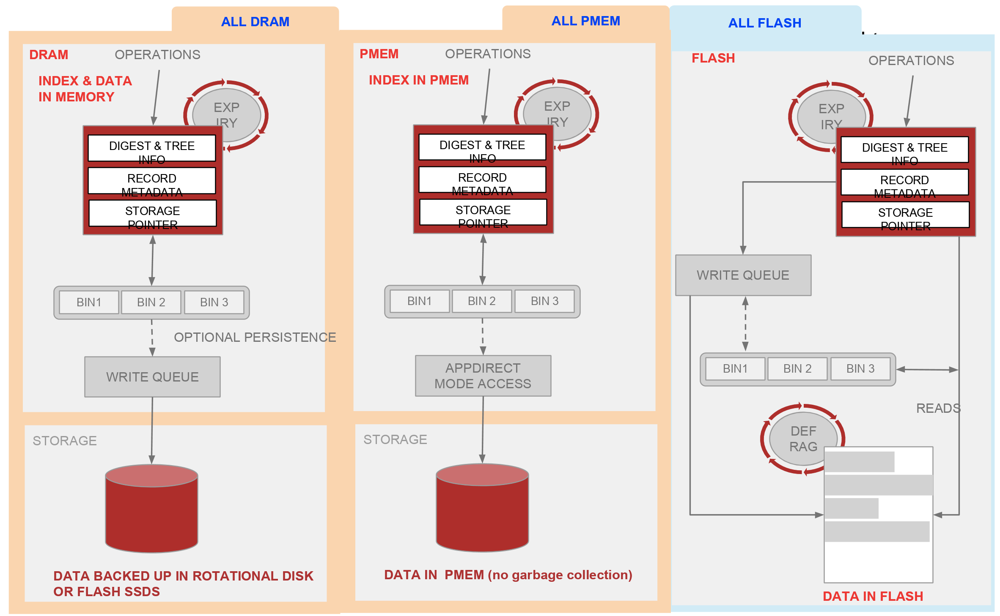

## Hybrid Storage

Aerospike 可以将数据存储在以下任何类型的介质及其组合上：

- Dynamic Random Access Memory (DRAM).
- Non-volatile Memory extended (NVMe) Flash or Solid State Drive (SSD).
- Persistent Memory (PMEM).
- Traditional spinning media.

The Hybrid Storage System (混合存储系统) 包含存储在每个节点中的索引和数据，处理与物理存储的交互，包含用于自动从数据库中删除旧数据的模块，并对物理存储进行碎片整理以优化磁盘使用率。

该讨论首先设计混合存储配置，然后是有有关每个单独存储介质的详细信息。

#### Contents

- [Analyzing Hybrid Storage for Your Needs](#analyzing-hybrid-storage-for-your-needs)
- [About namespace, records, and storage](#about-namespace-records-and-storage)
- [DRAM](#DRAM)
- [SSD/Flash](#SSD-Flash)
- [PMEM](#PMEM)

###  Analyzing Hybrid Storage for Your Needs 

下图显示了混合存储引擎的可能配置。

尽管将索引和数据都存储在 PMEM 中似乎是一个显而易见的选择，但它们的有点有所不同。最好将其特性（以及 NVMe Flash）与客户端应用程序的数据模型相匹配。下表显示了放置主索引和数据的所有可能性的完整矩阵。并且所有可能性都是有意义的：与某些用例相匹配的可能性用蓝色突出表示，并在下面进行了详细说明。

下表是 high-level 比较，以快速突出显示混合存储选项之间的差异。

<table style="vertical-align: top;" cellpadding="24">
    <tbody>
        <tr>
            <td style="width: 64px;"><strong>&nbsp;</strong></td>
            <td style="width: 62px;"></td>
            <td colspan="3" style="text-align: center; width: 652px; background-color: rgba(0, 0, 0, 0.1);">
                <b>Data Storage</b>
            </td>
        </tr>
        <tr>
            <td style="width: 64px;"></td>
            <td style="width: 62px;"></td>
            <td style="text-align: center; width: 202px; background-color: rgba(0, 0, 0, 0.1);">
                <b>NVMe Flash</b>
            </td>
            <td style="text-align: center; width: 219px; background-color: rgba(0, 0, 0, 0.1);">
               <b>DRAM</b>
            </td>
            <td style="text-align: center; width: 231px; background-color: rgba(0, 0, 0, 0.1);">
                <b>PMEM</b>
            </td>
        </tr>
        <tr>
            <td rowspan="3" style="width: 64px; background-color: rgba(0, 0, 0, 0.1);">
                <b>Primary index storage</b>
            </td>
            <td style="text-align: center; background-color: rgba(0, 0, 0, 0.1); width: 62px;">
                <strong>NVMe Flash</strong>
            </td>
            <td style="text-align: center; width: 202px;">
                
                    <strong>All NVMe Flash</strong>:Ultra-large records sets.
                
            </td>
            <td style="text-align: center; width: 219px;">
                
                    Not recommended.	
                
            </td>
            <td style="text-align: center; width: 231px;">
                
                    Not recommended.	
                
            </td>
        </tr>
        <tr>
            <td style="width: 62px; background-color: rgba(0, 0, 0, 0.1);">
                <b>DRAM</b>
            </td>
            <td style="text-align: center; width: 202px;">
                
                    <strong>Hybrid</strong>: best price-performance.
                
            </td>
            <td style="text-align: center; width: 219px;">
                
                    High performance. No persistence.
                
            </td>
            <td style="text-align: center; width: 231px;">
                
                    Not common.
                
            </td>
        </tr>
        <tr>
            <td style="width: 62px; background-color: rgba(0, 0, 0, 0.1);">
                <strong>PMEM</strong>
            </td>
            <td style="text-align: center; width: 202px;">
                
                    <strong>Hybrid</strong>: Fast restart after reboot. Very large data sets.
                
            </td>
            <td style="text-align: center; width: 219px;">
                
                    Not recommended.
                
            </td>
            <td style="text-align: center; width: 231px;">
                
                    <strong>All PMEM</strong>: Fast restart after reboot, with high performance.
                
            </td>
        </tr>
    </tbody>
</table>

从右下角开始，使用 all-PMEM 配置的弊端很少。性能与 DRAM 相当，但每 bit 的成本更低，并且不会放弃持久性或从重新启动中快速恢复：几分钟而不是几小时。可以通过多种方式使用更高的性能，而不是仅限于以下几种：
 - 每个节点上更多的 transactions : 随着流量的增长，升级次数更少。
 - 每次 transaction 的计算量更多，例如更丰富的广告技术模型或欺诈检测。

另一种可能性是在应用程序中启用强一致性（SC）模式或持久写入，而在过去，实时性能的需要可能会排除这种可能性。即使 SC 不是一个绝对的要求，对于获得的操作效率而言，部署它的成本收益可能是值得的。

PMEM 中的数据的最终限制因素是处理器将支持的数量。当前一代的 Xeon Scalable 2 (Cascade Lake) 处理器最多支持每个插槽 3 TiB ： 即使在多插槽系统中，也无法容纳非常大的数据库。也可能处于经济考虑，因为支持大型地址空间的 Xeon 处理器具有很高的性价比。

对于超大型数据库，将所有 PMEM 专用于主索引是一个更好的选择。它比 DRAM 具有更高的成本效益，可扩展到更大的数据集，并保留了无需重建索引即可快速启动的优势。即使在 PB 级，由于 Aerospike 进行了优化以 block mode Flash storage , 性能仍然非常出色。

---

###  About namespace, records, and storage 

不同的命名空间可以具有不同的 storage engine。例如，您可以在 DRAM 中配置经常访问的小型命名空间，并将较大的命名空间放置在价格较低的存储设备（例如 SSD ） 中。

In Aerospike : 
 - 记录数据存储在一起。
 - 一行的默认存储大小为 1MB。
 - 存储是 copy-on-write 。
 - 碎片整理过程中会回收可用空间。
 - 每个命名空间的存储容量都是固定的，每个节点在每个服务器上必须有相同的命名空间，这就要求每个命名空间的存储容量是相同的。

---

###  DRAM 

纯 DRAM 存储 ————无持久性———— 可提供更高的吞吐量。尽管现代闪存存储具有很高的性能，但 DRAM 在更高的价格点上具有更好的性能（尤其是包括电源成本在内）。

Aerospike 使用 JEMalloc 分配数据，允许分配到不同的池中。长期分配，比如存储层，是单独分配的。JEMalloc 具有异常低的碎片属性。

Aerospike通过使用DRAM的多个副本来实现高可靠性。由于 Aerospike 在发生故障时或在集群节点管理过程中会自动重新分片和复制数据，因此可以在较高级别获得 *k-safety*。当节点返回联机状态时，其数据将自动从副本中补充。

Aerospike 使用随机 [data distribution](https://docs.aerospike.com/docs/architecture/data-distribution.html) 来保持数据不可用时，几个节点丢失很小。在本例中，我们在一个 10 节点的集群中有两个数据副本。如果两个节点同时丢失，则复制前的不可用数据量约为数据的 2% 或 1/50 。使用永久性存储层，读取总是从 DRAM 中的副本进行的。通过下面描述的数据路径进行写操作。

---

###  SSD/Flash 

从客户端收到写入（更新或插入）后，将在 row 上使用 latch，以避免对该集群在同一记录上发生两次冲突的写入（在网络分区的情况下，可以采取 conflicting write 以提供可用性，稍后再解决）。在某些集群状态下，可能还需要从其他节点读取数据并解决冲突。写入验证后，记录的内存表示形式将在主服务器上更新。将要写入设备的数据防止在写入缓冲区中。当写入缓冲区已满时，它将排队到磁盘中。写缓冲区大小（与最大行大小相同）和写吞吐量确定未提交数据的风险，并且配置参数允许刷新这些缓冲区以限制潜在的数据丢失。然后，副本及其内存索引将更新。所有内存中副本更新后，结果返回给客户端。

Aerospike 碎片整理程序跟踪磁盘上每个块上的 active records，并回收低于最低使用级别的块。

---

###  PMEM 

Aerospike Enterprise Edition 4.8 支持将记录数据存储在 Intel® Optane™ DC Persistent Memory (PMEM). Optance 将类似于 DRAM 的字节寻址能力和访问时间与 Flash NVMe 存储的持久性和密度相结合。 [PEME : Next-Generation at Memory Speeds](https://www.intel.co.uk/content/www/uk/en/it-management/cloud-analytic-hub/pmem-next-generation-storage.html) .

在早期版本中，Aerospike支持将主索引存储在PMEM中。 Aerospike 4.8版将PMEM支持扩展到记录数据本身。结合起来，它们提供了无与伦比的性能，同时保留了持久性和快速重启功能。