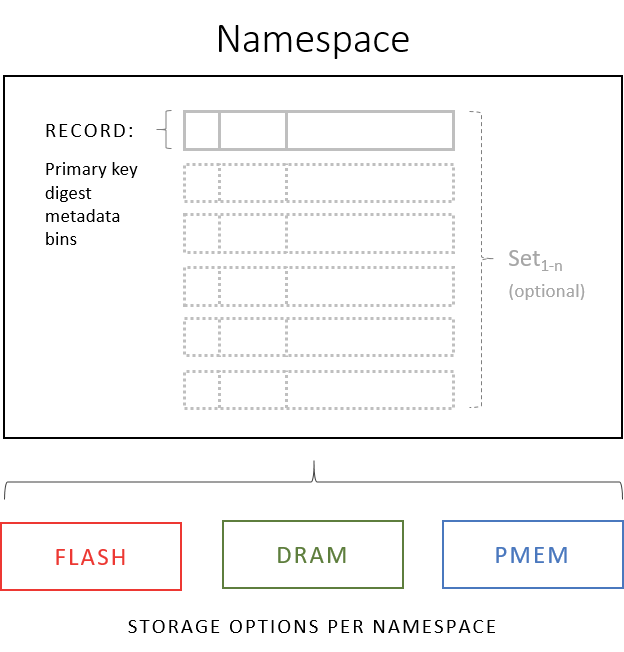
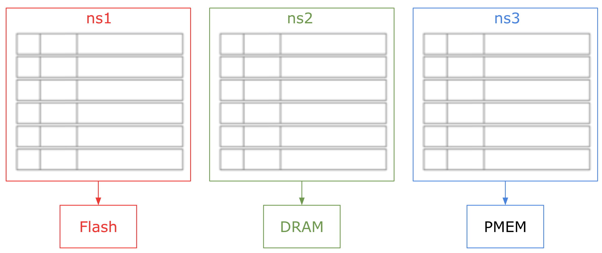
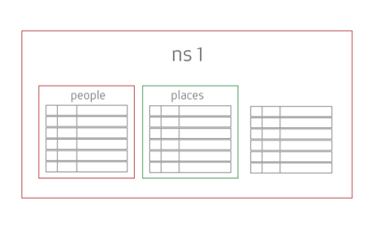

## Data Model

本节讨论 Aerospike 数据模型的组成部分以及它们之间的关系。

#### Contents
 
 - [Components of the Aerospike schemaless data model](#Conceptual-components-of-Aerospike-data-model)
    - [Physical storage](#physical-storage)
    - [Namespaces](#namespaces)
    - [Sets](#sets)
    - [Records](#records)
       - [Keys and Digests](#keys-and-digests)
       - [Metadata](#metadata)
       - [Bins and Data Types](#bins-and-data-types)
    
---

### Components of the Aerospike schemaless data model 

Aerospike 数据库不需要传统的 RDBMS (Relational Database Management System) schema。而是通过您对系统的使用来确定数据模型。例如，如果要向记录添加新的数据类型，则可以将该数据类型写入记录，而不必先更新任何 schema。

| Component | Description |
|--- | --- |
| physical storage | 您可以为每个命名空间选择所需的特定存储类型： NVMe Flash, DRAM 或 Intel Optane Persistant Memory (PMEM). 同一集群中的不同命名空间可以使用不同类型的存储（请参考 [hybrid storage](https://docs.aerospike.com/docs/architecture/storage.html) ）。物理存储介质也称为 *storage engine* 。 |
| namespace | 类似于 RDBMS 中的 tablespace，namespace 是一组记录的共享，这些记录共享一个特定的 storage engine，并且有诸如 replication factor，encryption 等通用策略。一个数据库可以包含多个 namespace。 |
| record | 记录是与 RDBMS 中的行相似的对象。它是一个连续存储单元，用于存储由单个 key 唯一标识的所有数据。 |
| set | 可以将记录分组放入 sets。sets 类似于 RDBMS 中的 table，但是没用显式的 schema。 |
| bin | 一条记录被细分为 bin，类似于 RDBMS 中的列。每个 bin 都有自己的数据类型，不需要在记录之间达成一致。二级索引可以选择声明 bins。 |

---

###  Physical storage 

[Hybrid Storage](https://docs.aerospike.com/docs/architecture/storage.html) 讨论了各种物理存储。

---

###  namespaces 

*Namespace* 是顶层的数据容器。在命名空间中收集数据的方式与数据的存储和管理方式有关。命名空间包含 records , indexes, and policies. Policies 规定了命名空间的行为，包括：

 - How data is physically stored. (如何物理存储数据。)
 - How many replicas exist for a record. (一条记录中存在多少个副本。)
 - When records expire. (记录何时过期。)

 更多信息，请参见 [Configuring Namespaces](https://docs.aerospike.com/docs/operations/configure/namespace) .
 
 数据库可以指定多个命名空间，每个命名空间具有不同的策略以适合您的应用程序。您可以考虑将数据绑定到存储设备的命名空间物理容器。

这说明了一个具有多个名称空间ns1，ns2和ns3的数据库，每个命名空间都有自己的存储引擎。

 - ns1 stores records on Flash/SSD.
 - ns2 stores records in DRAM.
 - ns3 stores records in PMEM.

---

###  Sets 

在命名空间中，记录可以属于成为 set 的可选逻辑容器。 Sets 允许应用程序对集合中的记录进行逻辑分组。Sets 继承其命名空间定义的策略。您可以定义特定于该 set 的其他策略或操作。例如，可以为特定 set 指定二级索引，或者可以在特定 set 上执行扫描操作。

命名空间中的记录不必位于 set 中，而仅属于命名空间。

这显示了属于 ns1 命名空间的两个 sets， people and places，其中还包含不在 set 中的记录。

---

###  Records 

 Record 是数据库中存储的基本单位。Records 可以属于命名空间，也可以属于命名空间内的 sets。一条 record 由一个 key 唯一标识。records 包含 ：
 
| Component | Description |
| --- | --- |
| key | record的唯一标识符。摘要也可以访问记录，摘要是由客户端对 key 进行哈希处理而创建的唯一对象标识符。 | 
| metadata | 包含版本信息（generation count），记录的到期时间（time-to-live or TTL），以及最后更新时间（LUT）。 |
| bins | Bins 存储记录数据。bin的数据类型由其包含的数据值设置。多个 bin（和数据类型）可以存储在单个记录中。 | 

---

###  Keys and Digests 

通过使用客户端，应用程序通过提供记录的 key (or digest)以及一个或多个操作(in an atomic transaction)，对存储在数据库中的记录执行操作。 

---

###  Metadata 

每条记录包含以下 metadata :

 - A generation count 跟踪记录修改周期，即 "lineage" 。The generation count 在读取时返回给应用程序，它可以使用 check-and-set（CAS）模式，来确保要写入的数据自从上次读取以来没有被修改。
 - Time-to-live (TTL) 指定记录的可选到期时间。从 Aerospike 数据库 4.9 版开始，默认情况下将禁用 expirations。如果使用 TTL，则每次写入记录时都会重置。对于服务器版本3.10.1及更高版本，客户端可以设置策略以在更新记录时不修改TTL。
 - last-update-time (LUT) 指定记录更新的时间戳。此元数据在数据库内部，不会直接返回给客户端。

---

###  Bins and Types 

记录数据存储在 bin 中。 Bins由 name 和 value 组成。容器不指定数据类型，而是由容器中包含的值定义数据类型。这种动态数据类型为数据模型提供了灵活性。例如，一条记录可以包含带有字符串 bob 的 bin id。bin 的值始终可以更改为其他字符串值，但也可以更改为其他数据类型的值，例如整数。

没有 schema, 因此每个记录可以具有自己不同的 bin set。您可以随意添加和删除 bins。

Bin 值可以是 [native supported data type](https://docs.aerospike.com/docs/guide/data-types.html) 中的任何一种。

有关 Bin 上限的详细信息，请参见 [Upper Sizing Bounds and Naming](https://docs.aerospike.com/docs/guide/limitations.html) 。