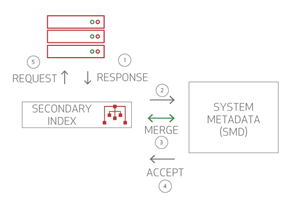
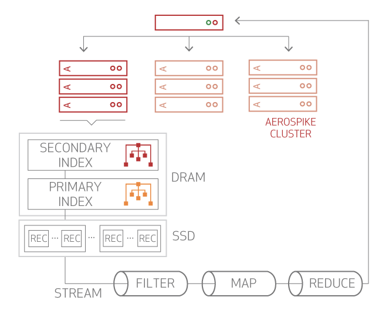

## Secondary index

仔细规划二级索引的使用，以避免可能的性能影响。 
有关指导，Enterprise Licensees can contact [Aerospike Support](https://www.aerospike.com/support/) 。

#### Contents

- [Data Structure](#data-structure)
- [Secondary Index Metadata](#secondary-index-metadata)
- [Secondary Index Creation](#secondary-index-creation)
    - [Priority of Secondary Indexes](#priority-of-secondary-index-creation)
- [Writing Data with Secondary Indexes](#writing-data-with-secondary-indexes)
- [Garbage Collection](#garbage-collection)
- [Distributed Queries](#distributed-queries)
    - [Query Result](#query-result)
    - [Query Execution During Migrations](#query-execution-during-migrations)
- [Aggregation](#aggregation)
    - [Performance Techniques](#performance-techniques)

---

###  Data Structure 

Secondary indexes are on non-primary key, 它使您可以建立一对多关系的模型。 Secondary indexes 是 bin-by-bin
指定的（与RDBMS列一样）。这样可以进行有效的更新，并最大程度地减少存储索引所需的资源量。

您可以使用 Aerospike 工具或 API 根据要建立索引的 bin 和数据类型动态创建和删除索引。对于已建立索引的 bin，更新记录包含 bin 将更新索引。

对索引条目进行类型检查，即，如果你有一个存储用户年龄的 bin，并且年龄值由一个应用程序存储为字符串，而另一个应用程序以整数存储，则整数索引会排除包含存储在已索引的 bin 中的字符串值的记录，而字符串索引不包括具有存储在索引 bin
中的整数值的记录。

  
<mark>展开查看原版内容</mark>

  
 Index entries are type checked i.e If you have a bin that stores user age, and the age value is stored as a string by one application and an integer by another application, an integer index excludes records containing string values stored in the indexed bin, while a string index excludes records with integer values stored in the indexed bin.

Secondary indexes:
  - 存储在 DRAM 中以便快速查找。
  - 建立在集群中的每个节点上，并且主索引位于同一位置。每个二级索引条目仅包含节点本地记录的引用。
  - 包含指向节点中 master records and replicated records 的指针。

---

###  Secondary Index Metadata 

Aerospike跟踪在全局维护的数据结构 ———— the System Metadata (SMD) system 中创建的索引。SMD 模块位于多个节点上的多个二级索引模块的中间。对二级索引所做的更改总是从 SMD 触发的。

SMD 工作流程为:

 1. 客户端请求触发与二级索引元数据有关的 创建，删除或更新。请求通过二级索引模块传递到 SMD 。
 2. SMD 将请求发送到 paxos 主服务器。
 3. paxos 主服务器从所有集群节点请求相关的元数据。
 4. 一旦接收到所有数据，它将调用二级索引合并回调函数。此函数解析二级索引的获胜的元数据版本。
 5. SMD 向所有集群节点发送请求，集群节点接受新的元数据。
 6. 每个节点执行二级索引创建或删除 DDL 函数。
 7. 触发扫描并返回客户端。

---

###  Secondary Index Creation 

Aerospike 支持动态创建二级索引。工具 (例如 [aql](https://docs.aerospike.com/docs/tools/aql) )可用于读取当前索引，并允许创建和销毁索引。

要构建二级索引，请指定 namespace, set, bin, container type(none, list, ma), and data type(integer, string, Geospatial, list, map, and so on)。在 SMD 确认后，每个节点均以 write-active mode 创建二级索引，并启动 background scan 以扫描所有数据并在二级索引中插入条目。

 - 仅为匹配所有索引规范的记录创建二级索引条目。
 - 扫描将填充二级索引，并与普通扫描完全一样地进行 read/write transactions 交互，只是索引创建没有网络组件。在索引创建期间，所有影响索引属性的新写入都会更新索引。索引扫描创建完成并在所有集群节点上都创建了所有索引条目后，该索引将标记为 read-active，并且可供查询使用。
 - 如果具有数据的节点加入集群但缺少索引定义，则在加入集群后会创建索引并进行填充。在索引填充期间，不允许查询以确保传入节点上的数据在可用之前是干净的。

当集群的格式不正确或遇到完整性问题时，请避免创建或删除索引。二级索引构建是一项繁重的 I/O 子系统操作，因此仅应在低负载期间进行。

####  Priority of Secondary Index Creation 

索引创建扫描仅读取已由 transaction 提交的记录（即，不允许进行脏读取）。这意味着只要没有记录的更新来阻止读取，扫描就可以全速执行。

为了确保索引创建扫描不会对正在进行的 read and write transactions 的延迟产生不利影响，默认设置就足够了，因为它们基于平衡长时间运行的任务（例如数据 rebalancing and backup）与低延迟的 read/write transactions。如有必要，可以将索引构建优先级设置为适当的级别。使用 Aerospike 实施引擎中的作业优先级设置可以控制索引创建扫描的资源使用率。

---

###  Writing Data with Secondary Indexes 

写入数据时，将检查当前索引的 SMD 格式(规范)。对于所有具有索引的 bin，将执行二级索引 update-insert-delete 操作。请注意，Aerospike 是 flexschema system。如果特定 bin 上不存储索引值，或者bin值不是受支持的索引类型，则不执行相应的 secondary action。

在 single-lock synchronization 下，对二级索引的所有更改都与记录更改原子地执行。由于索引不是持久的，因此删除了提交索引和数据的 difficult commit 问题，从而提高了访问速度。

---

###  Garbage Collection 

在删除数据时（例如，在 delete, expiry, eviction, or migration operations），不会从磁盘上读取数据以从二级索引中删除条目。这避免了 I/O 子系统上不必要的负担。二级索引中的其余条目将由后台线程删除，该线程会定期唤醒并执行清除操作。

该垃圾收集器被设计为非侵入式的。它会创建要分批删除的条目列表，然后将其从索引中缓慢删除。这就要求在具有高 expiration and eviction 率的系统中为二级索引提供内存。

---

### Distributed Queries

这说明了具有分布式查询的索引体系结构。

每个集群节点都会接收该查询，以从二级索引中检索结结果。执行查询时：

1. 请求 "scatter" (分发) 到所有节点。
2. 二级索引放置在 DRAM 中，以快速映射 secondary-to-primary keys。
3. 二级索引与SSD上的数据共存于每个节点上，以提供快速更新性能。
4. 从所有SSD和DRAM并行读取记录。
5. 结果在每个节点上聚合。
6. 从所有节点 "gathered" (收集) 结果并将其返回给客户端。

二级索引查询可以评估 a long list of primary key records (一长串的主键记录)。这就是 Aerospike 小批量执行二级索引查询的原因。批处理也会在客户端响应上发生，因此，如果达到内存阈值，响应会立即刷新到网络，就像 Aerospike 批处理请求中的返回值一样。这使单个 secondary query 的内存使用情况保持恒定大小，耳语选择性无关。

####  Query Result 

查询过程确保每次执行查询并扫描记录时，结果都与实际数据同步。未提交的数据读取永远不会成为查询结果的一部分。

####  Query Execution During Migrations 

在数据迁移期间，获取准确的查询结果非常复杂。添加或删除集群节点后，它会调用 **Data Migration Module** 以根据新配置在节点之间来回转换数据。在迁移操作期间，分区可能在许多节点上具有不同版本。对于要定位带有请求数据的分区的查询，Aerospike查询处理使用集群节点之间共享的其他分区状态，并为每个分区选择一个可以执行查询的节点。该节点可以是将数据迁移到新的主节点的分区的主节点，旧的主节点或副本节点。即使存在多个版本的数据，也不会执行 duplicate resolution。

---

###  Aggregation 

查询记录可以注入 aggregation framework 以执行 filtering, aggregation 等。每个节点将查询结果发送到 User-Defined Function (UDF) sub-system，以作为 a stream of records 启动结果处理。 调用 [Stream UDFs](https://docs.aerospike.com/docs/architecture/udf.html#stream-udf) ，并将用户定义的操作序列应用于查询结果。客户端应用程序收集每个节点的结果，然后客户端应用程序可以对数据执行其他操作。

####  Performance Techniques 

为了确保 aggregation 不会影响数据库整体性能，Aerospike使用以下技术：
 - 全局队列管理通过不同处理阶段提供的记录，线程池有效地利用了CPU并行性。
 - 查询状态在整个线程池中共享，因此系统可以管理 Stream UDF pipeline。

除了初始数据获取部分外，聚合中的每个阶段都是 CPU-bound 操作。快速且最佳地完成流程非常重要。为了简化此过程，Aerospike批量处理记录并缓存 UDF states，以最大程度减少系统开销。

 - 对于命名空间 (data-in-memory) 操作，不需要进行存储提取，Aerospike会在单线程上下文中实现流处理。即使进行了这种优化，系统也可以跨数据分区并行化操作，因为 Aerospike 在本地上将数据划分为固定数量的分区。
