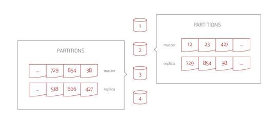
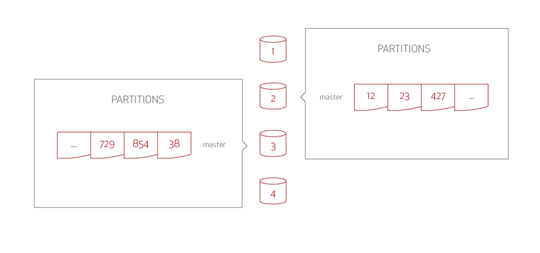

## Data Distribution

Aerospike Database 使用 **Shard-Nothing** 架构，其中:
- Aerospike集群中每个节点都是相同的。
- 所有节点都是对等体。
- 没有单点故障。

使用 Aerospike Smart Partitions™ 算法，数据可以在集群中的所有节点之间平均分配。

---

### Partitions

在 Aerospike 数据库中，命名空间是具有公用存储（例如在特定驱动器上）和策略（例如命名空间中每个记录的副本数）的数据集合。每个命名空间均分为 4096 个逻辑分区，这些分区在集群之间平均分配。这意味着，如果集群中有 n 个节点，则每个几点将存储大约 1/n 的数据。

#### Record Distribution to Partitions

Aerospike 使用确定性哈希过程将记录一致地映射到单个分区。为了确定对分区的记录分配，使用 RIPEMD160 将记录的 key (任意大小) 散列到 20 字节的固定长度摘要中。使用摘要的 12 位，确定记录的分区 ID。

RIPEMD160 是经过现场测试的，极为随机的哈希函数，可确保记录在分区的基础上非常均匀地分布。分区遵循集群中不同节点的正态分布（与均值相差 3 个标准差）。

#### Partition Distribution to Cluster Nodes

Aerospike中的分区分布具有以下特征
- Aerospike使用随机哈希函数来确保分区均匀分布到集群节点。无需手动分片。
- 集群中的所有节点都是对等节点——没有单个数据库主节点会发生故障并使整个数据库宕机。
- 当添加或删除节点时，将形成一个新的集群，并且其节点将进行协调，以在家它们之间平均分配分区。然后，集群将自动 re-balance。

由于数据在集群节点之间均匀（且随机）分布，因此没有一个节点处理的请求任何其他节点都要多得多的热点或瓶颈。例如，在美国，许多姓氏以 R 开头。如果按照字母顺序存储数据，则处理以 R 开头的姓氏的服务器比处理以 X, Y 或 Z 开头的姓氏的服务器的流量要大的多。随机数据分布可确保均衡的服务器负载。

---

### Data Replication and Synchronization

为了提高可靠性，Aerospike 在一个或多个节点上复制分区。一个节点成为分区读写操作的数据主节点，而其他节点则存储其副本分区。

这说明了一个 4 节点的 Aerospike 集群，其中每个节点是大约 1/4 数据的数据主节点，每个节点是 1/4 数据的副本。一个节点是主数据。数据作为副本分布在所有其他节点上。对于此示例，如果节点 1 变得不可用，则来自节点 #1 的副本将散布在其他节点上。

replication factor 是可配置的；但是，它不能超过集群中的节点数。副本越多，可靠性越好，但由于对所有副本的写请求必须更高，因此集群的需求也更高。大多数部署使用 2 的副本因子（一个 master copy 一个 replica）。

在没有网络故障的情况下，同步复制可提供更高级别的正确性。在提交数据并将结果返回给客户端之前，write transaction会传播到所有副本。在集群重新配置的极少数情况下，由于短暂过期，当Aerospike Smart Client可能将请求发送到错误的节点时， Aerospike Smart Cluster™ 透明地将请求代理到正确的节点。当集群从分区中恢复时，可能存在不同分区中应用了冲突的写操作。在这种情况下，Aerospike会采用启发式方法来选择最可能的版本，它解决了数据不同副本之间发生的任何冲突。默认情况下，选择更改次数最多的版本 (highest generation count) ，但是可以选择修改时间最近的版本。正确的选择将由数据模型决定。

#### Aerospike Cluster with No Replication

在 Aerospike 数据库中，没有复制数据就是 replication factor = 1 —— 数据库只有一个副本。

这说明了一个四个节点集群的两个节点，总共有 4096 个分区。每个节点包含数据的 1/4 的随机分配（1024个分区）。每个服务器/节点都管理该分区集合。

每个节点都是数据分区的 1/4 的数据主节点（当节点是读取和写入该数据的主要源时，节点就是数据主节点）。Aerospike Smart Client 可识别位置。它知道每个分区的位置，以便在单个跃点中实现数据检索。每个读取和写入请求都发送到主数据以进行处理。The Smart Client 读取记录并将请求发送到该记录的正确的数据主节点。

#### Aerospike Cluster with Replication

在 Aerospike 数据库中， replication factor = 2 表示存储数据有两个副本：master and replica。

这说明每个节点都是 1/4 数据（1024个分区）的数据主节点，每个节点都是 1/4 数据（1024个分区）的副本。请注意，一个主数据的数据作为副本分布在所有其他集群节点上。如果节点 #1 变得不可用，那么节点 #1 的数据副本将分布到所有其他集群节点。

同样，Smart Client 读取记录，并将请求发送到该记录的正确主数据节点。当节点收到写请求时，它将保存数据并将整个记录转发到副本节点。一旦副本节点确认成功写入并且该节点自己写入数据，确认会返回给客户端。

---

### Automatic Rebalancing

Aerospike数据重新平衡机制可确保查询量在所有集群节点之间平均分配，并且在节点故障期间保持持久性。该系统是连续可用的。重新平衡不会影响集群的行为。与数据分发系统集成的 transaction 算法可确保达成一致意见，以协调集群变更。对每个集群更改（而不是对每个 transaction）进行投票，可以提供更高的性能，同时保持 shard-nothing 的简单性。

Aerospike允许配置选项指定重新平衡的进行速度。暂时变慢的 transaction 可以更快地恢复集群。如果需要保持事务处理的速度和数量，则集群重新平衡的速度会更慢。

在重新平衡期间，Aerospike不会保留所有分区的完整副本因子。一些传输中的分区暂时成为单个副本，以便在集群重新平衡以获得新的稳定性时提供最大的内存和存储可用性。

通过不需要操作员的干预，集群即使在最苛刻的时间也能自愈。例如，在一个客户部署中，一个机架断路器跳闸，一个 8 节点集群中的一个节点发生故障。无需操作员干预。几个小时后，故障得到纠正，机架又恢复了在线状态。运营商无需采取特殊步骤即可维护Aerospike集群。

在 Aerospike 中，容量规划和系统监控几乎可以管理任何故障，而不会损失服务。您可以配置和提供硬件容量，并设置 replication/synchronization policies，以便数据库从故障中恢复，而不会影响用户。

---

### Traffic Saturation Management

Aerospike 数据库监控工具可以让您评估瓶颈。网络瓶颈会降低数据库的吞吐量，从而使请求变慢。

---

### Capacity Overflows

在存储溢出时，Aerospike stop-write 限制会阻止新纪录的写入。复制和迁移写入以及读取将继续进行处理。因此，即使超出最佳容量，数据库也不会停止处理请求。他继续尽可能多的处理用户请求。