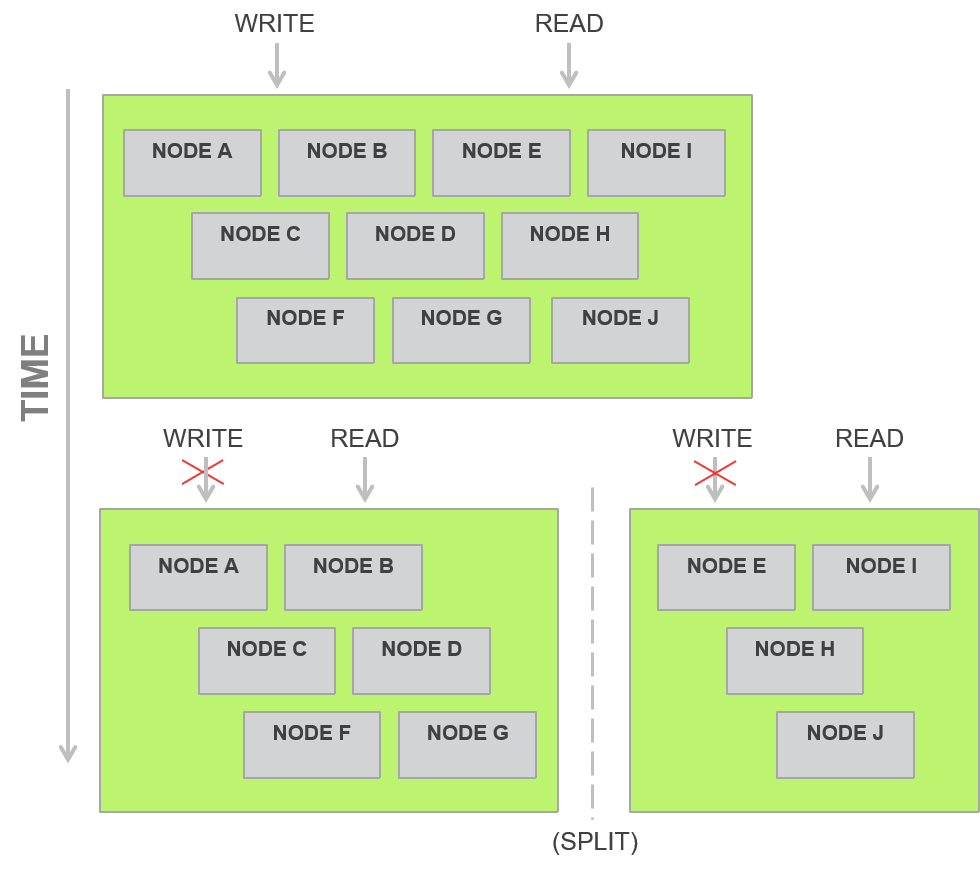
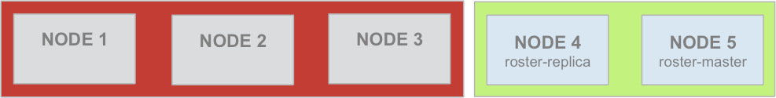
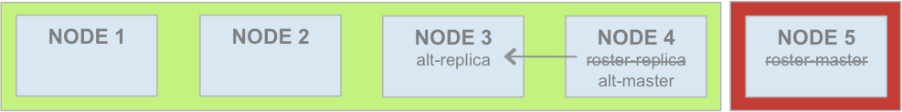
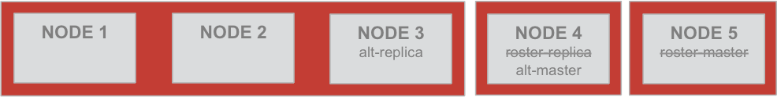
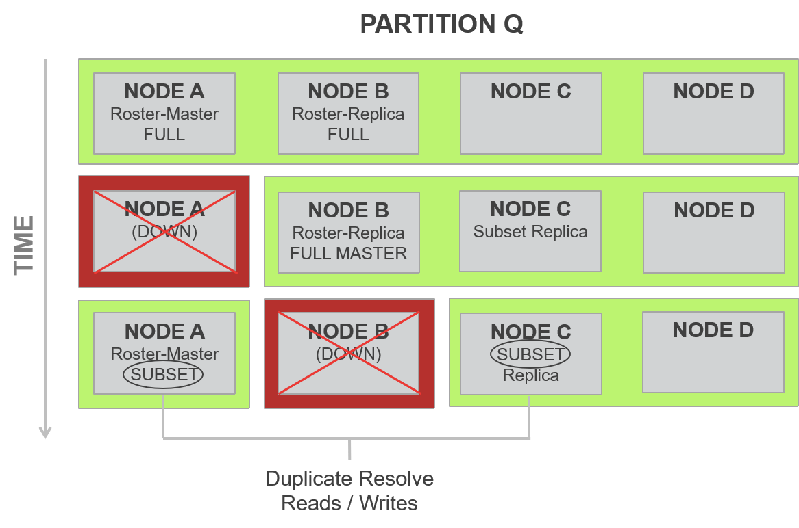
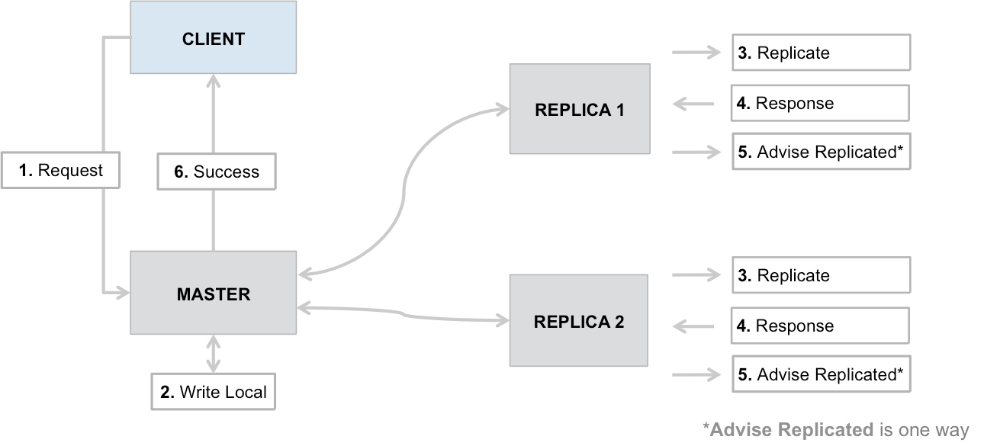
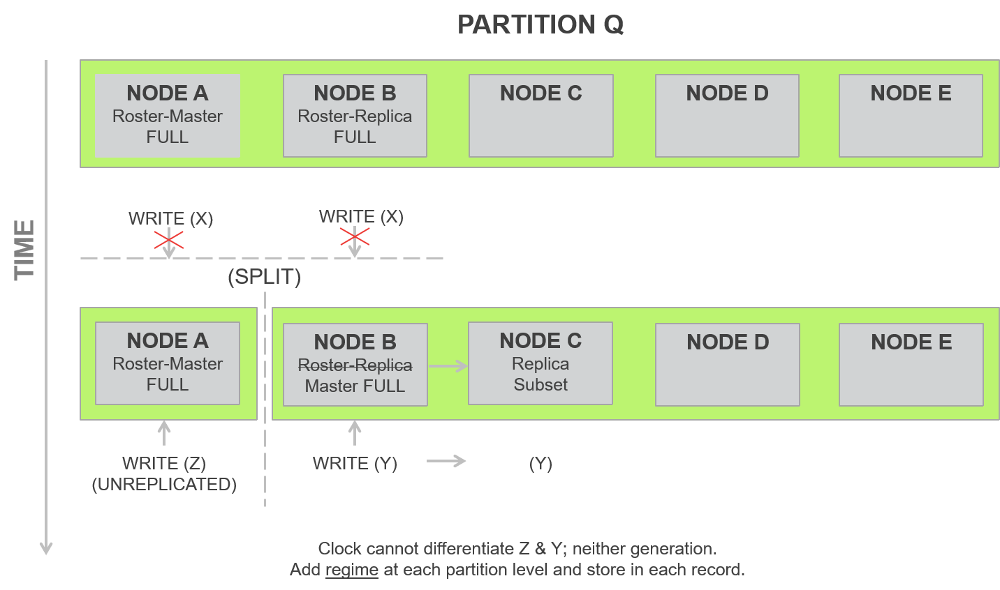

## Strong Consistency mode

Aerospike的数据库可以配置为 *Available and Partition-tolerant(AP)* 或 *Consistent and Partition-tolerant(CP)*。

当提到 CP 模式时，Aerospike使用术语 *strong consistency* 。
- 有关 Aerospike 对这些想法的理论和历史发展，请参阅 [CAP and ACID](https://docs.aerospike.com/docs/architecture/acid.html) 。
- 有关配置强一致性的精确详细信息，请参阅 [Configuring Strong Consistency](https://docs.aerospike.com/docs/operations/configure/consistency/index.html) 。

##### Content 
- [Available mode](#available-mode)
- [Strong Consistency mode](#strong-consistency-mode)
    - [Roster of nodes](#roster-of-nodes)
    - [Full partitions versus subsets](#full-partitions-versus-subsets)
    - [Strong Consistency for reads](#strong-consistency-for-reads)
    - [Linearizing reads](#linearizing-reads)
    - [Session/Sequential Consistency](#session/sequential-consistency)
    - [Relaxed Consistency](#relaxed-consistency)
   
---

###  Available mode 

作为一个分布式数据库，Aerospike支持自动数据复制。通常，数据库维护每个记录的多个相同副本，称为 replication factor。 Aerospike 通常以两个数据副本（即 replication factor 2）运行。Aerospike服务器支持其他副本因子，这些副本因子可以在每个命名空间的基础上进行配置。请参阅 [Data Distribution](https://docs.aerospike.com/docs/architecture/data-distribution.html) 。

自动数据复制使系统具有高性能和高可用性的有点，但以 transaction 延迟为代价。在运行良好的网络环境中，增加的延迟成本非常低，但是在集群重新配置期间或网络故障期间（所有副本可能尚未同步到最新副本）可能是一个问题。Write transaction 等待时间受副本因子的影响，因为将更改提交给驻留在非主服务器节点上的副本需要进行额外的集群内通信。

默认情况下，Aerospike立即将写操作应用于副本。当网络正常运行时，这将导致数据一致性，因为在每次 transaction 期间涉及记录的所有副本，并且不会造成过时或脏读的情况。在发生网络分区的情况下，Aerospike将优先考虑可用性而不是一致性—— Aerospike将允许每个子集群中进行读取和写入。

默认的 Aerospike server-client 提供以下行为：

- 即使在集群重新配置期间，Read transaction 也仅查询单个副本（通常是 master）。
- Write transaction (包括删除和UDF应用程序)将在本地写入，然后再成功从 transaction 返回之间同步写入所有副本。

对于以高可用为中心的数据库，这些选项以略微的网络开销为代价，来换取更高的正确性。与不同步复制的数据库相比，延迟将保持较低水平，并且可以观察到更高水平的正确性。然而，这并不能提供一致性。

对于使用非默认设置的读取，将看到更多的陈旧读取，因为稍后读取可能会为记录返回更早的值（例如，当集群在进行重新配置，主副本还没有最新的写入副本时。）

对于使用非默认设置的写操作，可能会丢失更多写操作，因此数据写入主服务器但未成功复制时，transaction可能返回成功。

为了最大程度地提高应用程序的灵活性，Aerospike提供了每个 transaction 可选的数据策略。使用这些与副本相关的策略，可以针对所需性能和数据一致性级别调整应用程序。

---

###  Strong Consistency mode 

强一致性保证指出，对单个记录的所有写入都将以特定的顺序(sequentially)applied，并且写入不会重新排序或跳过。

特别是，与统一记录的其他写入相比，被确认为已提交的写入已被 applied，并且存储于 transaction 处理时间轴中。即使面对网络故障，中断和分区，此保证也适用。被指定为"超时"（或客户端API中的"InDoubt"）的写入可能会或可能不会被 applied，但是如果已 applied，则只能这样观察。

Aerospike 的强一致性保证是按记录的，并且不涉及多记录 transaction semantics。每条记录的写入或更新将是原子的并且是隔离的，并且使用混合始终可以保证顺序。

Aerospike提供了完整的 Linearizable 模式（可在所有可观察数据的客户端提供一个线性视图）以及更实用的 Session Consistency 模式，该模式可确保单个进程看到顺序的更新集合。可以在逐个读取的基础上选择这两个读取策略，从而允许少数需要更高保证的transaction支付额外的同步代价，下面将详细介绍这两个策略。

在"timeout"返回值的情况下（可能是由于网络拥塞而产生的，是任何Aerospike问题的外部原因），保证写操作是完全写的，或者根本不写。永远不会出现部分写入的情况（也就是说，永远不会出现至少一个副本但非所有副本都被写入的情况）。在无法跨所有副本复制写 transaction 的情况下，记录将处于 "un-replicated" 状态，从而在记录上的任何后续 transaction（read or write） 之前强制执行 "re-replication" transaction 。

基于 Lamport 关于一致性算法需要三份数据副本的证明，大多数提供这种强一致性的系统至少需要三份副本才能确保正确地保持一致性。因此，如果集群存在上图所示拆分，则如果两个子部分之一具有数据项的大部分副本（三分之二），则可以允许写入。

Aerospike通过定期只允许存储两个副本但使用自适应方案来进一步优化此性能，该方案可在需要的情况下即时添加多个写副本，从而在正常情况下优化性能，而在极端情况下会产生少量开销很少发生。首先，在强一致性模式下，Aerospike定义了集群的 roster。

####  Roster of nodes 

这定义了处于稳定状态下属于集群的节点列表。当所有名单节点都存在且所有分区均为最新分区时，集群将处于稳定状态并提供最佳性能。如我们先前在分区算法中所述，主分区和副本分区是使用对节点的随机分配来分配给集群中的节点的。在强一致性的情况下，这些分区称为 roster-master and roster-replica 。为了简化讨论，我们将自己限制在副本因子设置为 2 的系统上。系统中的每个分区都将具有一个 master 和一个 replica。

首先是一些术语：
`roster-replica` - 对于特定分区，`roster-replica`是指如果名单中的所有节点都属于单个集群（即整个集群）的一部分节点，则名单副本指的是包含该分区副本的节点。

`roster-master` - 对于特定分区，`roster-master`是指如果名单中所有节点都属于单个集群（及整个集群）的一部分节点，则名单主机主节点指的是将容纳该分区的主节点的节点。

现在将以下规则应用于分区的可见性：
1. 如果一个子集群（又称 split-brain, 脑裂）同时具有某个分区的 roster-master 和 roster-replica，则该分区对于该子集群中的读取和写入均处于活动状态。
2. 如果子集群具有大多数节点，并且在其组成节点内具有该分区的 roster-master 或 roster-replica，则该分区对于该子集群中的读取和写入均处于活动状态。
3. 如果子集群恰好具有整个集群（名单）中一半的节点，并且其组成节点中有 roster-master，则该分区对于读取和写入均处于活动状态。

上述规则还暗示以下内容：

滚动升级具有 100% 的可用性：如果子集群的丢失节点数少于副本因子，则该集群被称为超多数子集群，并且所有分区对于集群内的读/写都是活动的。

双向脑裂的 100% 可用性：如果系统正好拆分为两个子集群，则所有分区均处于活动状态，可以在一个或另一个子集群中进行读写操作（稍后我们将展示如何以创造性的方式使用它用于基于机架的HA架构）。

以一个 5 节点集群中的分区 p 为例，其中节点 4 是 p 的名单副本，节点 5 是 p 的名单主副本。您可以在下面的图22，图23，图24和图25中看到在各种分区情况下何时可用分区或不可用分区的示例。

图22：所有名单副本均处于活动状态，整个集群

图23：少数子集群同时具有 roster-master and roster-replica，p处于活动状态

图24：roster-replica为多数子集群，成为 master-replica，p为活动状态，节点3为新副本。

图25：roster-master and roster-replica 位于少数集群中，p处于非活动状态

### Full partitions versus subsets

如上图所示，在稳定情况下，分区被视为 full (因为它们具有所有相关数据)。在某些情况下，例如在上面图24中，在节点 3 中创建了分区 p 的备用副本，知道节点 4 上分区副本中的所有数据都与节点 3 同步之后，节点 3 上的分区才是一个子集。请注意，节点 4 具有分区 p 的完整副本，因为它是从完全可用的集群中分离出来的。关于合适以及如何检查第二个副本的规则，以确保线性度与顺序一致性。我们将使用以下场景对此进行说明。

在具有五个节点 A, B, C, D, E 的集群中，让我们考虑分区q，其中节点A为 roster-master，节点B为 roster-replica。让我们考虑一次升级，一次删除一个节点。最初，节点A和B开始时是q的完整分区。卸下节点A后， roster-replica 的节点B升级为q的备用主服务器，而节点C变为q的备用副本。节点C的分区q副本现在是一个子集。在成功的软件升级之后，很快，足够多的节点A重新加入了集群（作为子集），并且节点B现在掉线以进行升级。此时， roster-master A没有足够的时间完成所有数据与B的同步（即 full）。因此，生效的节点A是 roster-master，它是分区q的子集，而节点C是q的另一个子集。此时，因为这是一个超级集群，所以我们可以保证在集群中的所有节点中，对该分区的所有更新都是可用的。这是因为每次更新都必须写入至少两个节点（replication factor 2），并且在任何一次最多只能关闭一个节点。所有更改必须仍然在这些节点之一中。但是，这意味着对于所有读取A（roster-master）的记录，每个请求都必须使用存储在节点C中的分区子集，逐条记录地自行解决。这将暂时增加读取的额外开销。由于Aerospike一直都在向两个副本写入数据，因此写入开销永远不会增加。

图26：滚动升级过程中的自己和完整分区，因此，较早的规则可以进一步限定如下：
1. 如果子集群具有分区的所有指定副本（roster-master and roster-replicas），并且子集群中存在完整分区，则该分区对于该子集群中的读取和写入均处于活动状态。
2. 如果子集群具有大多数 roster 节点，并且在组成节点中具有该成员的分区的 roster-master or roster-replica，并且具有完整的分区，则该分区可用。
3. 如果子集群恰好具有整个集群（roster）中节点的一半，并且其组成节点中具有roster-master，并且具有分区的完整副本，则该分区对于读取和写入均处于活动状态。
4. 如果子集群具有多数（即子集群中缺少的节点少于副本因子），则子集分区的组合足以使分区处于活动状态。

请注意，在计算多数和超多数时，会排除某些特殊类型的节点
- 具有一个或多个 empty drives 的节点或没有数据的全新节点
- 启用了未完全关闭的节点（除非 commit-to-device）

这样的节点将设置一个称为 "evade flag"(逃避标志) 的特殊标记，直到它们与所有数据一起正确引入集群为止。

当我们使用副本因子2讨论以上内容时，该算法扩展到了较高的副本因子。所有写操作都写入每个副本，因此，当副本因子增加到2以上时，写开销将增加。

图27：写逻辑

写逻辑如图27所示。在系统返回 success 给客户端之前，所有写都会提交给每个副本。如果其中一个副本写入失败，主服务器将确保在集群（或子集群，如果系统受到威胁）中完成对副本的适当数量的写操作。

#### Strong Consistency for reads

在 Aerospike 强一致性设置中，读取始终发送到主分区。请注意，客户端软件所依赖的主要不变式 (main invariant) 是服务器维护单个主范式 (master paradigm)。但是，由于 Aerospike 是分布式系统，因此可能会有一段时间，多个节点认为它们是一个分区的主节点。例如，考虑集群的节点A与其他四个节点B, C, D 和 E 分开的情况。B自动接管分区q，而C成为新副本。现在，重要的是区分正在执行写操作的分区的版本。注意，唯一成功的写入是在副本因子节点上进行的写入。其他所有写入均不成功。同样，基于前面提到的规则，只有一个子集群才有可能接替一个分区的主节点。即使在这种情况下，也无法仅通过使用时间戳来分离在主节点挂起(overhang)期间发生的写入。因此，Aerospike为分区添加了一种regime的概念。每当分区的master handoff发生时，该regime就会增加。只有旧的master使用较早的regime，而所有写入新的master都将使用下一个regime。这意味着，通过与数据处于活动状态新子集群的较大regime编号进行比较，可以丢弃对尚未处理集群更改的主节点上的分区所做的更改。

图28: 包括 regime, last update time, and record generation

Aerospike使用以下每个记录作为隔离记录更新的机制：
- 40 bits of record last update time (LUT)
- 6 bits of partition regime
- 10 bits of record generation

基于 1.8 秒的心跳间隔，6 bits的 regime 提供了大约 27 秒的缓冲区，并且在这段时间内发生了大约 32 次集群更改。regime 和 LUT 以及 generation 的组合提供了一个准确的路径，以确定系统中哪些记录是适合读和写的值。

#### Linearizing reads

基于上述内容，为了使服务器上的读取线性化，对主分区的每次读取都需要验证该 key 所在的分区的 partition regimes 是否同步。如果 regimes 一致，则保证 read 是最新的。如果 regimes 不一致，则意味着集群更改可能正在进行中，重做/重试来自客户端的 read 很重要。因此，对于每次写入，要写入的分区的所有副本也必须具有相同的 regime。

####  Session/Sequential Consistency 

在这种情况下，服务器端只需要从master读取。Aerospike客户端基于其读取分区时遇到的最新 regime，将 partition regime （32-bit partition version counter）存储为分区表的一部分。这是为了确保Aerospike客户端拒绝任何来自旧服务器的读取，而不是它已经读取的服务器。这可能是由于系统行为缓慢或云环境中虚拟机的 suspension/slowdown 等导致的特别大的 master overhang 。

#### Relaxed Consistency 

还有两个宽松的一致性客户端策略： "allow replica" and "allow unavailable"。使用 Relaxed Consistency modes, 客户端将继续仅读取已提交的记录，但读取将不再严格单调(strictly monotonic)。

在实践中，很难遇到 "allow replica" 策略违反 Session Consistency 的情况。此策略意味着使用 Strong Consistency 的应用程序不会看到读取超时，否则在节点（或机架）发生故障时可能会发生读取超时。此外，它使客户端能够使用 "preferred rack"(首选机架) 策略，该策略通常用于减少各种云环境中的跨区域网络利用率。

"allow unavailable" 策略允许客户端读取标记为不可用的分区上以前提交的记录，从而进一步放松了一致性。此模式允许对读取不可用敏感的应用程序在 major network/cluster 中断期间继续运行。当分区可用时，策略集的行为与 "allow replica" 完全相同。