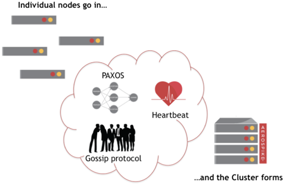
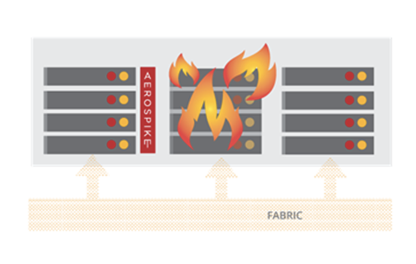

## Clustering

Aerospike的可靠性保证始于集群故障检测 (cluster failure detection)。发生集群节点故障或网络事件时，Aerospike会快速回复并重新构建集群。要设置集群，首先要安装一个节点，然后根据需要添加其他节点。

##### Content
- [Active-active deployments](#active-active-deployments)
- [Heartbeat](#heartbeat)
- [High-speed Distributed Cluster Formation](#high-speed-distributed-cluster-formation)
- [Clustering Benefits](#clustering-benefits)
   - [What happens when a node fails ?](#what-happens-when-a-node-fails)
    
---

###  Active-active deployments 

多站点集群 (Multi-Site Clustering) 和 跨数据中心复制 (Cross-Datacenter Replication) 提供了两种在 active-active 配置中部署 Aerospike 的独特机制。有关使用这两种模型的更多信息，请参见 [Active-Active Capabilities in Aerospike Database 5](https://www.aerospike.com/blog/active-active-deployments/) 。

---

###  Heartbeat 

集群节点使用 [heartbeat](https://docs.aerospike.com/docs/operations/configure/network/heartbeat) 功能相互跟踪。使用心跳，节点可以协调自己。节点是对等的。没有主节点。所有节点都跟踪集群中的其他节点。在节点管理期间，所有集群节点都使用心跳机制检测更改。

Aerospike使用以下方法定义集群：
- **Multicast** 使用 IP:PORT 广播心跳消息。
- **Mesh** 使用一台Aerospike服务器的地址加入集群。

这说明了如何构建典型的Aerospike集群。

---

###  High-speed Distributed Cluster Formation 

Aerospike检测到集群更改后，其他节点将使用基于Paxos的gossip投票过程来确定哪些节点构成了集群。Aerospike Smart Partitions™ 算法会自动重新分配分区并重新平衡集群。确定性哈希算法 (deterministic hashing algorithm)始终将记录映射到同一分区。数据在整个生命周期中都保留在同一分区中，但是分区可以从一台服务器移动到另一台服务器。

Aerospike使用基于 Paxos 的 gossip 算法来确保在最小数量的关键共享状态(critical shared state)上达成一致。这个共享状态的最关键部分是参与集群的节点列表。每当节点到达或离开时，算法都会运行以确保一致。此过程只需要几分之一秒。在此阶段之后，每个节点都统一参与者及其在集群中的顺序。使用此信息，可以计算任何 transaction 的主节点以及副本节点。

由于可以计算有关任何 transaction 的基本信息，因此 transaction 可以更简单并使用经过验证的数据库算法。因为仅涉及节点的最小子集，所以这导致最小的等待时间。

---

###  Clustering Benefits 

Aerospike分布式处理可确保数据的可靠性。其他竞争数据库从大型SSD的单台服务器获得高吞吐量。Aerospike提供了两种垂直扩展功能 - 使用闪存的服务器每秒处理上几百万 transactions，DRAM处理上千万。使用集群，数据库可以提供水平扩展和更高的可用性，因为数据存储在多个服务器上。如果服务器发生故障，则所有数据库访问都将停止。一个典型的配置有一些节点，每个节点有一些闪存设备。

与其他数据库相比，Aerospike在更少的服务器上运行，从而降低了成本。Aerospike可以帮助您进行部署计划，以帮助您从尽可能少的服务器中获得最佳冗余。在Aerospike分布式，shared-nothing 的架构中，节点可以自我管理和协调以确保可靠性，这使得随着集群流量的增加而易于扩展。

集成 Aerospike Smart Client（随使用Aerospike API的任何应用程序一起提供），您的应用程序可以忽略节点管理，让客户端处理集群通信。Aerospike数据库提供了监控工具来跟踪容量，瓶颈，诊断硬件故障等。

在Aerospike数据中，即使存储达到容量或硬盘故障，对服务的影响也很小。

####  What happens when a node fails ? 

在示例四个节点的集群中，如果节点 #3 发生硬件故障，则节点 #1, #2 和 #4 会自动检测到故障。节点 #3 是 1/4 数据的主节点，但是这些分区也作为副本存储于节点 #1, #2 和 #4 上。这些节点自动执行数据库迁移以复制副本分区并创建数据masters。例如，分区23在节点 #4 上副本并复制到节点 #2，该节点成为分区23的新master。同时，您的应用程序（包括Aerospike Smart Client™）将意识到节点 #3 的故障并自动计算新的分区map。将节点条件到集群时，此过程相反地发生。

以我们的示例为例，当节点 #3 重新启动并重新加入集群时，或者将另一个节点添加到集群以提供更大的容量时，这些节点将使用心跳来彼此定位。将节点添加到集群时，集群将开始数据迁移，使新节点成为某些分区的主节点，并使其成为其他分区的副本。客户端自动检测任何更改，以确保将来的请求发送到正确节点。Aerospike确保集群同步，以便集群充当热副本(hot replicas)。

但是，如果整个集群崩溃了怎么办？请参阅 [Cross Datacenter Replication](https://docs.aerospike.com/docs/architecture/xdr.html) 。