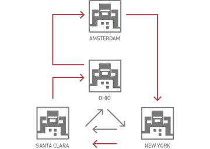
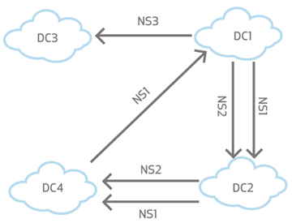

## Cross-Datacenter Replication (XDR) Architecture

Aerospike跨数据中心复制（XDR）功能通过较高延迟的连接（通常是 WAN）异步复制集群数据。  
该讨论是 Aerospike XDR 的 high-level 架构的概述。

##### Contents

- [Configuring XDR](#configuring-xdr)
- [Replication granularity: namespace, set, or bin](#replication-granularity)
    - [Shipping namespaces](#shipping-namespaces)
    - [Shipping specific sets](#shipping-specific-sets)
    - [Shipping bins](#shipping-bins)
    - [Shipping record deletes](#shipping-record-deletes)
- [Compression disabled by default](#compression-disabled-by-default)
- [General mechanism of XDR: comparison of LUT and LST](#general-mechanism-of-xdr)
- [XDR Topologies](#xdr-topologies)
    - [Active-passive topology](#active-passive-topology)
    - [Mesh topology](#mesh-topology)
        - [Bin convergence](#bin-convergence)
    - [Star topology](#star-topology)
    - [Linear chain topology](#linear-chain-topology)
    - [Hybrid topologies](#hybrid-topologies)
    - [Local destination and availability zones](#local-destination-and-availability-zones)
    - [Cluster heterogeneity and redundancy](#cluster-heterogeneity-and-redundancy)
- [Failure handling](#failure-handling)
    - [Local node failure](#local-node-failure)
    - [Communications failure](#communications-failure)
    - [Combination failure](#combination-failure)

##### Terminology

- Aerospike将远程目标(remote destination)称为数据中心(datacenter)。示例，图标和参数通常使用缩写 "DC"，例如DC1, DC2, DC3等。
- 将数据发送到远程数据中心的过程称为 *运送 (shopping)* 。

---

###  Configuring XDR 

有关如何配置XDR的特定详细信息，包括本概述中讨论的功能的实例参数，请参阅 [Configure Cross-Datacenter XDR](https://docs.aerospike.com/docs/operations/configure/cross-datacenter/index.html)
。

---

###  Replication granularity: namespace, set, or bin 

副本是每个数据中心定义的。您还可以配置要发送的数据的粒度：

- 单个命名空间或多个命名空间。
- 全部 sets 或仅特定记录的 sets。
- 全部 bins 或单个 bins 的子集。

####  Shipping namespaces 

Aerospike节点可以具有多个命名空间。您可以配置不同的命名空间以运送到不同的远程集群。在此示例中，DC1 将命名空间 NS1 和 NS2 传送到 DC2，并将命名空间 NS3 传送到 DC3。使用这种灵活性可以为不同的数据集配置不同的副本规则。

 

####  Shipping-specific-sets 

您可以将 XDR 配置为将某些 sets 运送到数据中心。namespace 和 set 的组合确定是否传送记录。如果本地集群中的一个命名空间中的不是所有数据都需要复制到其他集群中，则使用 sets 。

####  Shipping bins 

您可以将 XDR 配置为仅运送某些 bins，而忽略其他 bins。默认情况下，所有的 bin 都会被运输。您可以使用 bin-policy 来决定要运输哪些 bins。

####  Shipping-record-deletes 

此外，您可以配置 XDR 来发送记录删除 (record deletions)。此类删除可以是来自客户端的删除，也可以是命名空间管理程序(namespace supervisor, nsup) 由于 过期 (expiration) 或 逐出 (eviction) 导致的删除。
- 默认情况下，会发送客户端的记录删除（始终会发送持久删除）。
- 默认情况下，不发送 nsup 从过期或逐出中删除记录。

---

###  Compression disabled by default 

默认情况下，XDR 不会压缩发送数据。为了节省带宽，必要时可以启用压缩。

---

###  General mechanism of XDR: comparison of LUT and LST 
1. 作为其基本功能之一，Aerospike服务器守护程序（ASD，可执行 asd）会根据写入 transaction 跟踪记录的摘要和上次更新时间（LUT）。
2. ASD 的 XDR 组件跟踪记录的上次发送时间 (Last Ship Time, LST)。LST由分区保存。
3. ASD 的 XDR 组件将记录的 LUT 与记录的 LST 进行比较。如果 LUT 大于 LST，则将记录传送到定义的远程数据中心中定义的远程节点的响应命名空间和分区。
4. 如果需要从发生故障的主节点中恢复这些 副本写入操作(replication writes)，也会对其进行跟踪。
5. 如果将 XDR 配置为发送 用户发起的删除(user-initiated deletes)或基于到期或逐出的删除，则这些 write transaction 也将运送到远程数据中心。
6. 记录的 LST 已更新。
7. 重复该过程。

---

###  XDR Topologies 

XDR 可配置拓扑 (topologies) 如下。用于 [Example configuration parameters for XDR topologies](https://docs.aerospike.com/docs/operations/configure/cross-datacenter/index.html#example-configuration-parameters-for-xdr-topologies) 中介绍了用于实现此处描述的拓扑的XDR配置示例。

####  Active-passive topology 

在 active-passive topology中，客户端写入单个集群。考虑两个集群A和B。客户端仅写入集群A。另一个集群B是一个备用集群，可用于读取。客户端写操作从集群A传送到集群B。但是，客户端写给集群B的消息未传送到集群A。此外，XDR提供了一种完全禁用客户端写入集群B的方法，而不仅仅是不发送它们。

Active-passive 的常见用例是数据的性能密集型分析(offload performance-intensive analysis)从主集群转移到分析集群。

####  Mesh topology (active-active) 

多站点集群 (Multi-Site Clustering) 和 跨数据中心复制 (Cross-Datacenter Replication) 提供了两种在 active-active 配置中部署 Aerospike 的独特机制。有关使用这两种模型的更多信息，请参见 [Active-Active Capabilities in Aerospike Database 5](https://www.aerospike.com/blog/active-active-deployments/) 。

在 active-active mesh topology 中，客户端可以写入不同的集群。当对一个集群进行写操作时，会将它们转发给另一个集群。 active-active topology 的典型应用是，客户端对记录的希尔与两个集群之一紧密相关，而另一个集群充当热备份 (hot backup)。

如果可以将同一记录同时写入两个不同的集群，则通常不适合使用 active-active topology。有关详细信息，请参见 [Bin convergence in mesh topology](https://docs.aerospike.com/docs/architecture/xdr.html#bin-convergence) 。

active-active topology 的一个示例是，一家公司，其用户分布在广泛的地理区域（例如北美）。然后可以在西海岸和东海岸的数据中心之间分配流量。虽然 West Coast 用户可以写入 East Coast 数据中心，但是不太可能在两个数据中心同时发生该用户的写入。

#####  Bin convergence in mesh topology 

Aerospike 5.4 版本引入的 bin收敛(bin convergence)功能，该功能可以帮助解决 mesh/active-active topology 中的写入冲突。此功能可确保复制结束时所有DC中的数据最终都是相同的，即使多个DC中的同一记录同时进行了更新。为了实现此目的，有关每个 bin 的 last update time (LUT) 的其他信息将存储并运送到目标集群。具有较高时间戳(LUT)的 bin 可以覆盖具有较低时间戳(LUT)的 bin。当至少一个 bin 更新成功时，XDR 写入操作成功，并且对于全部成功和部分成功都返回相同的消息。

需要注意的重要一点是，此功能更将仅确保收敛而不确保最终的一致性。某些中间更新可能会丢失。此功能将能够满足更关注最终状态而不是中间状态的用例。例如，如果应用程序正在跟踪设备的最后已知位置（可能是由多个跟踪器跟踪的），此功能非常适合。

如果中间更新很重要，则此功能不是正确的选择。例如，在数字钱包应用程序中，所有中间更新都非常重要。人们应该考虑多站点集群，这将不允许冲突首先发生。

更多信息参见 [Bin Convergence](https://docs.aerospike.com/docs/operations/configure/cross-datacenter/bin_convergence.html) 。

####  Star topology 

Star topology 允许一个数据中心同时将数据复制到多个数据中心。要使 XDR 可以将数据传送到多个目标集群，请在 XDR 配置中指定多个目标集群。Star replication topology 通常用于在多个位置发布和复制数据，以实现来自本地系统的低延迟读访问。

####  Linear chain topology 

Aerospike 支持 linear chain network topology，有时也称为 "linear daisy chain"。在 linear chain topology 中，一个数据中心将运送至另一个，然后再运送至另一个，再运送至另一个，以此类推，直到到达最终数据中心为止。

如果使用 chain topology，请确保不要形成 ring daisy chain。确保链是线性的：它再单个节点处结束，并且不会循环回到链的起点或其他任何链接。

####  Hybrid topologies 

Aerospike还支持上述拓扑的许多混合组合。

####  Local destination and availability zones 

虽然最常见的XDR部署在不同的数据中心中有本地集群和远程集群，但有时 "remote" 集群可能位于同一数据中心。造成这种情况的常见原因是：

- 本地目标集群(local destination cluster) 仅用于数据分析。将本地目标集群配置为 passive mode，然后在该集群上运行所有分析作业。这样可以将本地集群与工作负载隔离开，并确保可用性。
- 多个可用区域数据中心(Multiple availability zone datacenters)，例如 Amazon EC2，可以确保如果一个可用区域(availability zone)存在大规模问题，则另一个可用区可用。管理员可以在数据中心的多个可用区域中配置集群。为了获得最佳性能，集群中的所有节点必须属于同一可用区域。

####  Cluster heterogeneity and redundancy 

XDR 适用于不同的大小，操作系统，存储介质等的集群。XDR 故障处理功能允许源集群动态更改大小。当多目标数据中心(multiple-destination datacenters)频繁上下线时，它也可以工作。

本地集群的节点与远程集群的节点之间没有一对一的对应关系。即使两个节点的数目相同，分区在远程集群中的节点分布也可以与本地集群中的不同。本地集群的每个主节点都可以写入任何远程集群节点，就像任何其他客户端一样，XDR 将一条记录写入该记录的远程主节点。

---

###  Failure handling 

XDR 管理以下故障：

- Local node failure
- Remote link failure
- Combinations of the above

除了集群节点故障之外，XDR 还可以正常处理网络链接或远程集群的故障。首先，通过故障网络链接或到故障远程集群的副本被挂起。然后，一旦问题解决并且一切恢复正常，XDR将恢复先前不可用的远程集群并恢复正常。通过其他功能链接到其他功能远程集群的副本始终不受影响。

####  Local node failure 

XDR 提供与单个 Aerospike 集群相同的冗余(redundancy)。任何分区的 master 覆盖复制该分区的副本写入。当master发生故障并将副本提升为master时，新的master将接管发生故障的master停止的位置。

####  Communications failure 

如果本地集群和远程集群之间的连接断开，则每个主节点都会记录该链接断开并暂停受影响的远程数据中心的运送的时间点。当链接再次可用时，将以两种方式恢复发送：

- 发送新客户端写操作的方式与链接失败之前的操作相同。
- 会发送在连接故障期间发生的客户端写操作，即，在为受影响的远程集群暂停发送时被保留的客户端写操作。

当 XDR 配置为 star topology 时，集群可以同时运送到多个数据中心。如果一个或多个数据中心链接断开，则 XDR 会继续运送到其余可用的数据中心。

XDR 还可以处理更复杂的情况，例如本地节点故障和远程链接故障。

####  Combination failure 

XDR 还无缝管理组合故障，例如本地节点故障和远程连接故障，XDR 传送历史数据时的链接故障等。