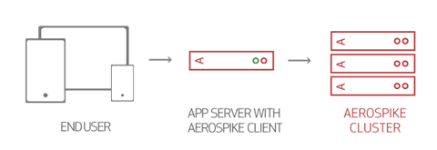
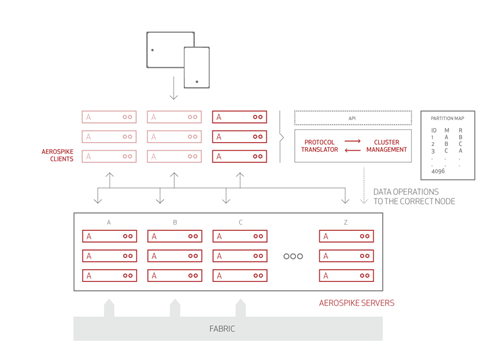

## Client Architecture

这说明了Aerospike客户端-服务器架构。

通常，无状态应用 (stateless applications) 驻留在一组单独的服务器上。为了与 Aerospike 集群进行通信，Aerospike 提供了一组数据库客户端驱动程序 —— *drivers* 。这些客户端提供集群状态检测，有效的 transaction routing 和 network connection pooling, 以及 failover protection。

客户端作为分布式(as source)构建到您的应用程序服务器中。它们提供方法函数，因此不需要负载平衡器层(load balancer tier)即可高可用运行。

当使用 Aerospike 客户端 API 库（例如 [C Client](https://docs.aerospike.com/docs/client/c) 或 [Java Client](https://docs.aerospike.com/docs/client/java) ）编译应用程序时，它包括Aerospike Smart Client™，该客户端使用二进制有线协议 (binary wire protocol) 连接到群集中的服务器。

---

### Client Library Capabilities

这些 Aerospike Client API 功能可提供高性能和便捷的开发：

- 跟踪集群状态
    - 客户端可以随时使用 `info` 协议与集群进行通信并维护集群节点列表。
    - Aerospike Smart Partitions™ 算法确定哪些节点存储特定的数据分区。
    - 自动跟踪对应应用程序完全透明的集群大小更改，以确保 transaction 在传输期间不会失败，并且应用程序不需要在节点到达和离开时重新启动。
- 实现连接池
    - 您不必为集群编写代码，配置或管理连接池
- 管理 transaction，monitors timeouts，and retransmits request
- Thread safe
    - 在一个过程只需要一个实例。
    

除了基本的 `put()`, `get()`, `delete()` 操作外，Aerospike还支持：
- **CAS**(safe read-modify-write) operations.
- In-database counters.
- Batch `get()` operations.
- Scan operations.
- List and Map operations such as `removeByKey()` or `getByValueRange()`.
- Queries - Bin values are indexed and the database searched by equality or rage.
- User-Defined Functions(UDFs) extend database processing by executing application code in Aerospike.
- Aggregation - Use UDFs on a collection of records to return aggregate values.

---

### Client Feature Matrix

[Client Feature Matrix](https://docs.aerospike.com/docs/guide/client_matrix.html) 包含最新的客户端功能。