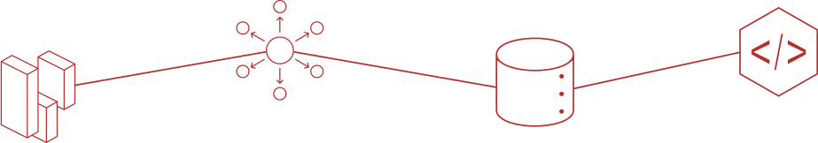
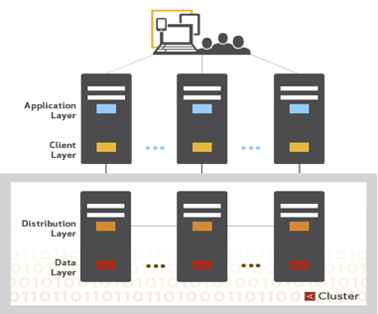
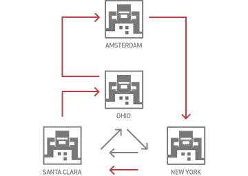
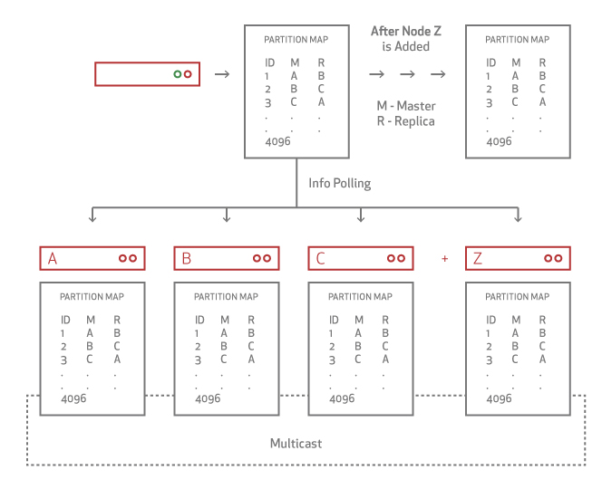
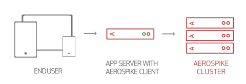

## Architecture Overview

Aerospike 是一个分布式、可伸缩的数据库。该体系结构有三个关键目标:
 - 为Web规模的应用程序创建一个灵活的，可扩展的平台。
 - 提供传统数据库所期望的鲁棒性和可靠性（如ACID）。
 - 以最少的人工参与提供运营效率。

如 [Proceedings of VLDB (Very Large Databases)](https://docs.aerospike.com/docs/architecture/assets/vldb2016.pdf) 中所述，Aerospike体系结构包括三层：

 - [Client Layer](https://docs.aerospike.com/docs/architecture/clients.html) : This cluster-aware layer 包括开源客户端库，这些客户端库实现了 Aerospike API，跟踪节点并知道数据在集群中的位置。
 - [Clustering](https://docs.aerospike.com/docs/architecture/clustering.html) and [Data Distribution Layer](https://docs.aerospike.com/docs/architecture/data-distribution.html) : This layer manages cluster communications and automates fail-over, replication, Cross-datacenter Replication (XDR), and intelligent re-balancing and data migration. (该层管理集群通信，并自动执行故障转移，复制，跨数据中心复制 (XDR)以及智能重新平衡和数据迁移。)
 - [Data Storage Layer](https://docs.aerospike.com/docs/architecture/storage.html) : 该层将数据可靠地存储在DRAM和Flash中，以便快速检索。

---

### Client Layer 
Aerospike Smart Client™专为提高速度而设计。它被实现为可在C，C＃，Java，Node.js和其他语言中使用的开源可链接库（请参阅 [Clients Download](https://docs.aerospike.com/download/client/) 页面上的完整列表）。开发人员可以贡献新 clients 或修改现有 clients。

客户端层：

 - 实现Aerospike API，客户端-服务器协议，并直接与集群对话。
 - 跟踪节点并知道数据存储在哪里，立即了解集群配置的更改或节点何时启动或关闭。
 - 实现自己的TCP / IP连接池以提高效率。还可以检测尚未上升到集群中节点故障级别的 transactions 故障，并将这些 transactions 重新路由到具有数据副本的节点。
 - 透明地将请求直接与数据一起发送到节点，并根据需要重试或重新路由请求（例如，在集群重新配置期间）。

这种架构减少了 transaction 等待时间，减轻了集群的工作负担，并消除了开发人员的工作。它可以确保在节点启动或关闭时，应用程序不必重新启动。而且，您不必浪费时间进行集群设置或添加集群管理服务器或代理。

---

### Distribution Layer

Aerospike 的 "Sharing nothing" 架构旨在通过自动故障转移，复制和跨数据中心复制（XDR）可靠地存储TB级数据。该层线性缩放。

The distribution layer 在通过对所有集群管理功能进行系统自动化来消除手动操作。它包括三个模块：

- **Cluster Management Module :** 跟踪集群中的节点。关键算法是 Paxos-based gossip-voting process ，该过程确定哪些节点被视为集群的一部分。Aerospike 实现了特殊的心跳（主动和被动）来监视节点间的连接。
- **Data Migration Module :** 添加或删除节点时，将确定Aerospike数据库集群成员身份。每个节点使用分布式哈希算法将主索引空间划分为数据切片(data *slices*)并分配所有者。Aerospike 数据迁移模块可智能的平衡集群中所有节点的数据分布，从而确保数据的每个 bit 都能在 all cluster nodes and datacenters 之间进行复制。此操作在系统 replication factor 配置中指定。

 - **Transaction Processing Module :** 根据 request 读写数据，并提供一致性和隔离性保证。该模块负责
    - **Sync/Async Replication :** 对于具有实时一致性的写入，它将在提交数据并将结果返回给客户端之前将更改传播到所有副本。
    - **Proxy :**  在极少数情况下，在集群重新配置过程中，当客户端层可能已过时时， Transaction Processing module 会透明地将请求代理到另外一个节点。
    - **Resolution of Duplicate Data :** 对于从分区中恢复的集群（包括重新启动节点时），此模块可借鉴不同数据副本之间的任何冲突。 The resolution 可以基于 generation count (version) or last update time 。
    

一旦第一个集群启动，您就可以在其他数据中心安装其他集群，并设置 [cross-datacenter replication](https://docs.aerospike.com/docs/architecture/xdr.html) ，以确保如果数据中心发生故障，则远程集群可以接管工作负载，而对用户的干扰很小或没有中断。

---

### Data Storage Layer

Aerospike 是具有 schemaless [data model](https://docs.aerospike.com/docs/architecture/data-model.html) 的 key-value store。数据流入策略容器， namespaces，这些在语义上类似于 RDBMS 系统中的数据库。在命名空间中，数据可细分为 *sets* (RDBMS tables) 和 *records* (RDBMS rows) 。每个记录在 set 中都有一个唯一的 indexed key，以及一个或多个 bins (RDBMS columns)，其中包含与该记录关联的值。

注意 :

 - 您不需要定义 sets 和 bins。为了获得最大的灵活性，可以在运行时添加它们。
 - bin 中值是强类型的，并且可以包含任何受支持的 [data-type](https://docs.aerospike.com/docs/guide/data-types.html) 。 Bins are not typed, 因此不同的记录可以有相同的 bin 且具有不同类型的值。

索引（包含 [primary index]() 和可选的 [secondary indexes]() ）默认情况下存储在 DRAM 中，已实现超快速访问。还可以将主索引配置为存储在 Persistent Memory or NVMe flash device 中。Values 可以存储在 DRAM 中，也可以更经济地存储在 SSD 中。您可以分别配置每个 namespace，因此较小的 namespace 可以利用 DRAM 的优势，而较大的 namespace 可以获得 SSD 的成本优势。

 The Data Layer 旨在提高速度并显著降低硬件成本。它可以在所有内存中运行，从而消除了对缓存层的需求，或者可以利用闪存的独特优化功能。无论哪种方式，数据都不会丢失。
 
In Aerospike :
 - 1亿个 key 仅占用 6.4GB。尽管 key 没有大小限制，但是每个 key 只能有效地存储在 64 个字节中。
 - Native, multi-threaded, multi-core Flash I/O and an **Aerospike log structured file system** 利用了 low-level SSD 读写模式。为了最大程度地减少延迟，对磁盘的写操作以大块执行。该机制绕过了标准文件系统，该系统过去一直调整为旋转磁盘。
 - **Smart Defragmenter** 和 **Evictor** 共同工作，以确保 DRAM 中有空间，并且数据永远不会丢失，并且始终安全地写入磁盘。
   - Smart Defragmenter : 跟踪每个块中的 active records 的数量，并且回收低于最低使用级别的块。
   - Evictor : 如果系统超出设置的高水位线，则删除过期的记录并回收内存。到期时间是按命名空间配置的。记录年龄是从上次修改开始计算的。应用程序可以覆盖默认生存期，并制定永远不要逐出记录。
   
---

### Operating Aerospike

在传统的（非分布式）RDBMS 中，在安装数据库软件之后，您将设置数据库 schema 并创建数据库和 table definitions。Aerospike数据库是完全不同的。

在分布式数据库中，数据在集群中的所有服务器之间分配（分布）。这意味着您不能简单地登录服务器以访问所有数据。

使用 Aerospike，您可以创建和管理数据库：

 - 通过配置初始数据库设置。Aerospike 数据库是 namespace。安装 Aerospike 时，集群中每个节点都必须配置每个 namespace，已制定如果创建和复制数据库。重新启动服务器后即会创建数据库。
 - 通过应用程序执行数据库操作。
   - 当您的应用程序首先引用 sets 和 bins (tables and fileds) 时，将创建 database schema。
   - Aerospike Database 是 flex-schema —— 您无需预先定义 database schema 。例如，要添加新的 bin (field)，您的应用程序只需开始将数据存储在指定的 bin 中。在 Aerospike 数据库中，通常由 DBA 在命令行上完成的任务会在应用程序中完成。
 - 根据需要更新配置文件。
   - 要更改 namespace parameters，只需动态更新配置文件，而无需重新启动即可动态更新，也可使用新的配置文件重新启动服务器。
   
为了提供高质量的性能和冗余，请计划和配置所需的节点数（请参阅 [Capacity Planning](https://docs.aerospike.com/docs/operations/plan/capacity/index.html) ）。

如果将节点添加到集群或将节点卸下进行升级或服务，则集群将自动重新配置。当一个节点发送故障时，集群中的其他节点将以最小的影响重新平衡工作负载。请参阅 [monitoring tools](https://docs.aerospike.com/docs/operations/monitor/index.html) 以获取可用可用监控使用程序的列表。

---

### Building Applications

定义了 namespace 后，您可以使用 Aerospike 工具来验证数据库是否正确存储了数据。在生产数据库中，数据分布在整个集群中。要执行数据库操作，请使用实例化应用程序的智能客户端。Smart Client 具有位置感知能力，并且知道如何存储和检索数据而不会影响性能。

Aerospike API 可帮助您构建大数据应用程序。请参阅您的应用程序语言的客户端指南。

在应用程序编译时，Aerospike API 库与 Smart Client 一起提供。Smart Client 是一个单独的线程/进程，用于监控集群状态以确定数据位置，从而确保在单跳 (single hop) 中检索数据。

这说明了 Aerospike 数据库集群如何支持位于 Web 服务器上的大数据应用程序，从而实现单跳操作。The Smart Client 允许您的应用程序忽略数据分发详细信息。

在 Aerospike 文档中， API 和 客户端可以互换。您的应用程序继承了 Aerospike API 和 Smart Client。