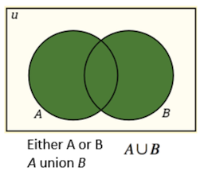
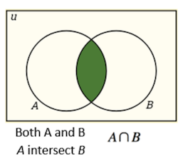

## HyperLogLog Data Type and Probabilistic Data

HyperLogLog bin 数据类型为您的应用程序提供大型数据集(large dataset)中成员的估计计数(_estimated_ counts)，以在多个 HyperLogLog bin 之间的联合或交集中形成快速、合理的成员近似值。HyperLogLog 的估计是在处理超大数据集时完全准确与有效节省空间和速度之间的平衡。

在本次讨论中，使用 "set" 和 "dataset"这两个词的含义来自数学集合论(mathematical set theory)，而不是 Aerospike 的 sets 概念。

##### Contents
- [Set theory fundamental background](#set-theory-fundamental-background)
    - [Union of sets](#union-of-sets)
    - [Intersection of sets](#intersection-of-sets)
- [Some business use cases](#some-business-use-cases)
    - [Bank fraud](#bank-fraud)
    - [Ad campaign scope](#ad-campaign-scope)
    - [Online sales conversion rate](#online-sales-conversion-rate)
- [HyperLogLog data and data modeling](#hyperloglog-data-and-data-modeling)
- [What the HyperLogLog data type returns to your application](#what-the-hyperloglog-data-type-returns-to-your-application)
    - [Calculating the size of the returned data](#calculating-the-size-of-the-returned-data)
- [Operations](#operations)
    - [Modify Flags](#modify-flags)
    - [Modify Operations](#modify-operations)
      - [init](#init)
      - [add](#add)
      - [set_union](#set-union)
      - [refresh_count](#refresh-count)
      - [fold](#fold)
    - [Read Operations](#read-operations)
      - [get_count](#get-count)
      - [get_union](#get-union)
      - [get_union_count](#get-union-count)
      - [get_intersect_count](#get-intersect-count)
      - [get_similarity](#get-similarity)
      - [describe](#describe)
- [Error Bounds](#error-bounds)
- [Performance](#performance)

---

### <span id="set-theory-fundamental-background"> Set theory fundamental background </span>

返回到应用程序的 HyperLogLog 数据基于集合论中的一些基本思想。 [Probabilistic: Definition, Models, and Theory Explained](https://www.statisticshowto.datasciencecentral.com/probabilistic/) 一文提供了一些概要的背景信息。

#### <span id="union-of-sets"> Union of sets </span>



#### <span id="intersection-of-sets"> Intersection of sets </span>



---

### <span id="some-business-use-cases"> Some business use cases </span>

HyperLogLog 数据类型对于您的基础数据无法为您提供确切答案的任何问题都很有用。一些业务用例包括为以下需求推导出可能的答案。

#### <span id="bank-fraud"> Bank fraud </span>

计算与账户及其交易相关的可疑指标的数量，以实时确定传入交易的欺诈概率。

#### <span id="ad-campaign-scope"> Ad campaign scope </span>

为给定的广告定位的用户细分，大概有多少人会看到广告？

### <span id="online-sales-conversion-rate"> Online sales conversion rate </span>

通过比较用户群组和他们对相邻商品的兴趣，有多少可能登陆网站的客户最终会在同一用户会话中购买商品？在多个会话中？

---

### <span id="hyperloglog-data-and-data-modeling"> HyperLogLog data and data modeling </span>

与所有 Aerospike 数据类型一样，您自己的值定义了底层 HyperLogLog 数据。您需要根据具有某种内在关系的值对数据进行建模，以便您可以得出单个数据集或多个数据集的并集或交集的成员计数。用通俗的话来说，你必须“把苹果比作苹果，但不能把苹果比作橙子”。

继续在线广告活动中的用户细分示例，您可能有代表用户 segment 的记录，每个记录都有一个 HyperLogLog bin 来表示 segment 中的成员资格。通过批量读取多个 segment 的 bin 返回的数据，可以向服务器询问多个 segment 的交集的成员数。例如：

- 所有热爱篮球的人。这是一个 segment，表示在一个记录的 HLL bin 中。
- 所有喜欢金州勇士队的人，另一段。
- 所有也喜欢帽子作为时尚配饰的人。

HLL bin 的含义特定于将用户识别为受众 segment 的一部分，并未广告活动计算这些 segment 以及它们之间的交集和并集的用例。

作为比较的基准，您可以在具有 HyperLogLog bin 的记录之间进行比较，这些记录表示特定于您的用例的相同类型的数据集。

您至少需要定义两个 HyperLogLog 数据集，以便可以探索它们之间的关系。数据的确切含义取决于您。

- 继续 [Some business use cases](#some-business-use-cases) 中的银行欺诈示例，您有记录表明您确实存在欺诈行为。使用 HyperLogLog 返回的数据，您的应用程序可以找到其他记录与已识别记录的模式相匹配的概率。
- 继续 [Some business use cases](#some-business-use-cases) 中的在线销售转化率的例子，需要定义以下内容：
    - Date/time of login to the website
    - Date/time of purchase
    
---

### <span id="what-the-hyperloglog-data-type-returns-to-your-application"> What the HyperLogLog data type returns to your application </span>

HyperLogLog 向您的应用程序返回以下信息：

- 集合的估计大小。
- 多个集合的并集的估计基数。
- 多个集合的估计相似度。
- 多个集合的交集的估计基数。
- 多个集合的估计并集。此估计值为 HyperLogLog 数据类型返回。

#### <span id="calculating-the-size-of-the-returned-data"> Calculating the size of the returned data </span>

由于 HyperLogLog 数据类型用于处理大型数据集，因此它返回的数据也可能很大。您需要了解 HyperLogLog bin 的存储成本。对于小数据集，HyperLogLog 以外的数据类型可能就足够了，但对于大数据集，不变的存储大学是非常有利的。

- 每个 HLL 包含 11 个字节的元数据和一个 2<sup>n_index_bits</sup> 寄存器数组。
- 每个寄存器包含 6 位 hll_val 和 n_minhash_bits 位 minhash_val 。寄存器的大小四舍五入到最接近的字节。

sizeof(HLL) = 11 + roundUpToByte(2<sup>n_index_bits</sup> x (6 + n_minhash_bits))

有关 bin 开销 的一般准则，请参阅 [Linux Capacity Planning](https://docs.aerospike.com/docs/operations/plan/capacity/index.html) 。

---

### <span id="operations"> Operations </span>

HyperLogLog 依赖于客户端应用程序使用的以下 API：

#### <span id="modify-flags"> Modify Flags </span>

| Name | Value | Description | 
| --- | --- | --- | 
| **create_only** | 0x01 | 禁止更新此 bin 的现有值。 |
| **update_only** | 0x02 | 禁止创建此 bin。 |
| **no_fail** | 0x04 | 如果单个操作因违反策略而失败，则允许一组操作继续进行。 |
| **allow_fold** | 0x08 | 允许结果集是提供的 **n_index_bits** 中的最小值。对于 intersect_counts 和 similarity，当所有参与集合的 **n_minhash_bits** 不匹配时，允许使用不太精确的 HLL 算法。 |

#### <span id="modify-operations"> Modify Operations </span>

##### <span id="init"> init </span>

```
init(policy, bin_name, n_index_bits)
```

初始化或重置标准 HyperLogLog。

```
init(policy, bin_name, n_index_bits, n_minhash_bits)
```

使用 minhash 信息 (see [HyperMinHash](https://arxiv.org/abs/1710.08436%22)) bits 初始化或重置 HyperLogLog，以提高交集和相似性估计的准确性。

**Flags :** create_only, update_only, no_fail。

**Arguments :**

&nbsp;&nbsp;&nbsp;&nbsp;    
**Policy** (library_specific) : HLL modify policy.

&nbsp;&nbsp;&nbsp;&nbsp;    
**bin_name** (string) : Name of bin.

&nbsp;&nbsp;&nbsp;&nbsp;    
**n_index_bits** (integer) : Number of index bits. Must between 4 and 16 inclusive.

&nbsp;&nbsp;&nbsp;&nbsp;   
**n_minhash_bits** (integer) : Number of minhash bits. Must be between 4 and 51 inclusive.

**Returns** (none)

---

##### <span id="add"> add </span>

```
add(policy, bin_name, items)
```
将值添加到 HLL 集。此表单假定 HLL bin 已存在。

```
add_mh(policy, bin_name, items, n_index_bits)
```
将值添加到 HLL 集。如果 HLL bin 不存在，则使用 n_index_bits 创建 HLL bin。

将值添加到 HLL 集。如果 HLL bin 不存在，则使用 n_index_bits 和 n_minhash_bits 创建 HLL bin。

**Flags :** create_only, no_fail.

**Arguments :**

&nbsp;&nbsp;&nbsp;&nbsp;    
**Policy** (library_specific) : HLL modify policy.

&nbsp;&nbsp;&nbsp;&nbsp;    
**bin_name** (string) : Name of bin.

&nbsp;&nbsp;&nbsp;&nbsp;    
**n_index_bits** (integer) : Number of index bits. Must between 4 and 16 inclusive.

&nbsp;&nbsp;&nbsp;&nbsp;   
**n_minhash_bits** (integer) : Number of minhash bits. Must be between 4 and 51 inclusive.

**Returns** (integer) : 导致 HLL 更新寄存器的条目数。

---

##### <span id="set-union"> set_union </span>

```
set_union(policy, bin_name, hlls)
```
将值添加到 HLL 集。此表单假定 HLL bin 已存在。

设置指定的 HLL 列表与 HLL bin 的并集。

**Flags :** create_only, update_only, allow_fold, no_fail.

**Arguments :**

&nbsp;&nbsp;&nbsp;&nbsp;    
**Policy** (library_specific) : HLL modify policy.

&nbsp;&nbsp;&nbsp;&nbsp;    
**bin_name** (string) : Name of bin.

&nbsp;&nbsp;&nbsp;&nbsp;    
**hlls** (list) : List of HLL objects.

**Returns** (none)

---

##### <span id="refresh-count"> refresh_count </span>

```
refresh_count(bin_name)
```

更新缓存计数（如果陈旧）并返回计数。有关相对误差，请参阅 [Error Bounds](#error-bounds) 。

**Arguments :**

&nbsp;&nbsp;&nbsp;&nbsp;    
**bin_name** (string) : Name of bin.

**Returns** (integer) : HLL 集中唯一条目的估计数量。

---

##### <span id="fold"> fold </span>

```
fold(bin_name, n_index_bits)
```

将 HLL bin 折叠到指定的 n_index_bits。

**Note** : Fails if existing HLL has n_minhash_bits set to non-zero.

**Arguments :**

&nbsp;&nbsp;&nbsp;&nbsp;    
**bin_name** (string) : Name of bin.

&nbsp;&nbsp;&nbsp;&nbsp;    
**n_index_bits** (integer) : Number of index bits. Must between 4 and 16 inclusive.

**Returns** (none) 

---

#### <span id="read-operations"> Read Operations </span>

##### <span id="get-count"> get_count </span>

```
get_count(bin_name)
```

估计 HLL 集中唯一条目的数量。有关相对误差，请参阅 [Error Bounds](#error-bounds) 。

**Arguments :**

&nbsp;&nbsp;&nbsp;&nbsp;    
**bin_name** (string) : Name of bin.

**Returns** (integer)

---

##### <span id="get-union"> get_union </span>

```
get_union(bin_name, hlls)
```

返回一个 HLL 对象，该对象是 hlls 列表中所有指定 HLL 对象与 HLL bin 的并集。

**Arguments :**

&nbsp;&nbsp;&nbsp;&nbsp;    
**bin_name** (string) : Name of bin.

&nbsp;&nbsp;&nbsp;&nbsp;    
**hlls** (list) : List of HLL objects.

**Returns** (HLL) : Hll 对象是 hlls 列表中所有指定 HLL 对象与 HLL bin 的并集。

---

##### <span id="get-union-count"> get_union_count </span>

```
get_union_count(bin_name, hlls)
```

估计这些 HLL 对象和 HLL bin 的并集将包含的元素数量。有关相对误差，请参阅[Error Bounds](#error-bounds) 。


**Arguments :**

&nbsp;&nbsp;&nbsp;&nbsp;    
**bin_name** (string) : Name of bin.

&nbsp;&nbsp;&nbsp;&nbsp;    
**hlls** (list) : List of HLL objects.

**Returns** (integer) 

---

##### <span id="get-intersect-count"> get_intersect_count </span>

```
get_intersect_count(bin_name, hlls)
```

估计这些 HLL 对象和 HLL bin 的交集将包含的元素数量。有关相对误差，请参阅[Error Bounds](#error-bounds) 。


**Arguments :**

&nbsp;&nbsp;&nbsp;&nbsp;    
**bin_name** (string) : Name of bin.

&nbsp;&nbsp;&nbsp;&nbsp;    
**hlls** (list) : List of HLL objects.

**Returns** (integer) 

---

##### <span id="get-similarity"> get_similarity </span>

```
get_similarity(bin_name, hlls)
```

估计这些 HLL 对象和 HLL bin 的相似性(或 [Jaccard Index](https://en.wikipedia.org/wiki/Jaccard_index) )。有关相对误差，请参阅[Error Bounds](#error-bounds) 。


**Arguments :**

&nbsp;&nbsp;&nbsp;&nbsp;    
**bin_name** (string) : Name of bin.

&nbsp;&nbsp;&nbsp;&nbsp;    
**hlls** (list) : List of HLL objects.

**Returns** (float) 

---

##### <span id="describe"> describe </span>

```
describe(bin_name)
```

包含 HLL bin 配置的 **n_index_bits** 和 **n_minhash_bits** 的列表。


**Arguments :**

&nbsp;&nbsp;&nbsp;&nbsp;    
**bin_name** (string) : Name of bin.

**Returns** (list)

---

### <span id="error-bounds"> Error Bounds </span>

#### `refresh_count`、`get_count`、`get_union_count`

**Error :**
&nbsp;&nbsp;&nbsp;&nbsp;  
**Relative Error :** 1.04 / sqrt(2<sup>n_index_bits</sup>)

|  |  |  |  |
| --- | --- | --- | --- | 
| 4 - 26.0000% | 5 - 18.3848% | 6 - 13.0000% | 7 - 9.1924% | 
| 8 - 6.5000% | 9 - 4.5962% | 10 - 3.2500% | 711 - 2.2981% | 
| 12 - 1.6250% | 13 - 1.1490% | 14 - 0.8125% | 15 - 0.5745% | 
| 16 - 0.4062% |

---

#### `get_intersect_count (relative error)`、`get_similarity (absolute error)`

**Absolute or Relative Error :**

当 **n_minhash_bits** 为零时，错误不稳定。 当 **n_minhash_bits** 非零时，可以通过以下方式找到错误：

其中 **e** 是相似度估计的目标误差，**t** 是感兴趣的最小相似度；选择 **n_minhash_bits** 和 **n_index_bits** 使得：

**n_minhash_bits** ≥ log <sub>2</sub> (6/et)

**n_index_bits** ≥ log <sub>2</sub> (e-2)

---

### <span id="performance"> Performance </span>

| Symbol | Description |
| --- | --- |
| N | index bits 数量。 |
| M | minhash bits 数量。 |
| S | 以字节为单位的 HLL 大小 (M + N) x 2 <sup> N </sup> |
| K | 正在运行的 HLL 的数量。 |
| C | memcpy 的成本（添加到所有修改中）。 |
| R | 存储读取成本（适用于任何 transaction — 每个 transaction 一次）。 |
| W | 写入存储的成本（适用于任何写入 transaction — 每个 transaction 一次）。 |

| Operation | HyperLogLog (n_minhash_bits = 0) | HyperMinHash(n_minhash_bits > 0) |
| --- | --- | --- |
| init | S | S |
| add | 1 | 1 |
| set_union | K × S | K × S |
| refresh_count | S | S |
| fold | K × S | K × S |
| get_count | S | S |
| get_union | K × S | K × S |
| get_union_count |  K × S | K × S |
| get_intersect_count | K! × S <br/> 0 ≤ K ≤ 2 | K × S + S |
| get_similarity | K! × S <br/> 0 ≤ K ≤ 2 | K × S + S |
| describe | 1 | 1 |
