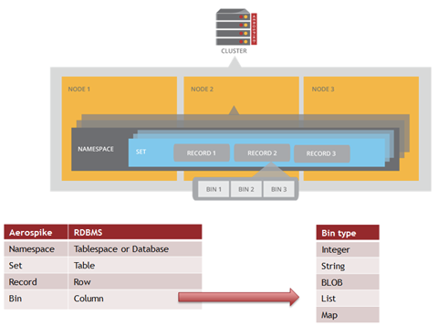

## Feature Guide Overview

这些功能指南介绍了以下主题的详细信息:

- Aerospike是面向行(row-oriented)的数据库，其中每个记录（相当于关系型数据库中的一行）均由 key 唯一标识。 记录的 key 及其他元数据位于主索引中。记录的数据保存在其占用的命名空间的预定义存储设备中。有关更详细的描述，请阅读 architecture overview 的 [Data Model](https://docs.aerospike.com/docs/architecture/data-model.html) 部分。Aerospike支持 [key-value store](https://docs.aerospike.com/docs/architecture/data-model.html) 和 [document store](https://docs.aerospike.com/docs/guide/data-types.html#complex-data-types-cdts-) 模型。

- Aerospike 每个 [bins](https://docs.aerospike.com/docs/architecture/data-model.html#bins) 都可以容纳不同的 [scalar](https://docs.aerospike.com/docs/guide/data-types.html#basic-data-types) or [complex](https://docs.aerospike.com/docs/guide/data-types.html#complex-data-types-cdts-) **data type**。 
- Aerospike 允许使用 [secondary indexes](https://docs.aerospike.com/docs/architecture/secondary-index.html) 进行基于值的 [queries](https://docs.aerospike.com/docs/guide/query.html) ，当字符串和整数 bin 值被索引，可以使用 equality (string or numeric) or range (numeric) 过滤器进行搜索。
- [User-Defined Functions(UDFs)](https://docs.aerospike.com/docs/guide/udf.html) 扩展了 Aerospike 数据库引擎的功能和性能。
- 在 Aerospike 中， [aggregations](https://docs.aerospike.com/docs/guide/aggregation.html) 框架可以实现快速，灵活的查询操作。与 MapReduce 系统类似，聚合以高度并行的方式发出结果。
- Aerospike 支持存储，索引和查询表示为 GeoJSON 的 [Geospatial](https://docs.aerospike.com/docs/guide/geospatial.html) data 。