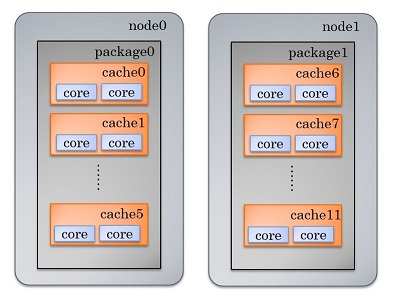
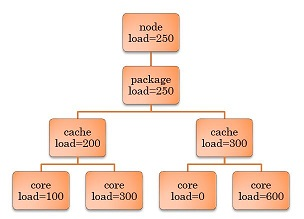
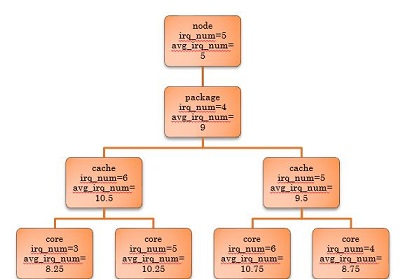

# irqbalance

irqbalance用于优化中断分配，它会自动收集系统数据以分析使用模式，并依据系统负载状况将工作状态置于 Performance mode 或 Power-save mode。

- 处于Performance mode 时，irqbalance 会将中断尽可能均匀地分发给各个 CPU core，以充分利用 CPU 多核，提升性能。
- 处于Power-save mode 时，irqbalance 会将中断集中分配给第一个 CPU，以保证其它空闲 CPU 的睡眠时间，降低能耗。（暂不讨论这种模式）。

简单来说，Irqbalance的主要功能是优化中断分配，收集系统数据并分析，通过修改中断对于cpu的亲和性来尽量让中断合理的分配到各个cpu，以充分利用多核cpu，提升性能。

分析代码之前，首先来了解两个概念，numa架构和smp_affinity。简单画个图来解释下numa：



​	NUMA模式时一种分布式存储器访问方式，处理器可以同时访问不同的存储器地址，大幅度提高并行性。NUMA模式下，处理器被划分成多个”节点“ （node），每个节点被分配的有本地存储器空间。所有节点中的处理器都可以访问全部的系统物理存储器，但是访问本节点内的存储器所需要的时间，比访问某些远程节点内的存储器所花的时间要少的多。 irqbalance就是根据这种架构来分配中断的。主要的原因是避免中断在节点中迁移产生过多的代价。

smp_affinity是用来设置中断亲缘的CPU的mask码，简单来说就是在CPU上分配中断。SMP affinity 是通过操作 /proc/irq/ 目录中的文件来控制的。在 /proc/irq 中是与你系统中存在的 irq 相对应的目录（不是所有的 irq 都可用）。在每个目录中都有 ”smp_affinity“文件。

首先看一下 irqbalance用到的数据结构是什么样的：


简单来说就是根据cpu的结构由上到下建立了一个树形结构，当然，为了平衡中断，每个节点还会挂接本节点分配的中断。

树形结构建立好之后，自然是开始分配中断。irqbalance中把中断分成了八种类型：

```shell
#define IRQ_OTHER   		0
#define IRQ_LEGACY			1
#define IRQ_SCSI				2
#define IRQ_TIMER				3
#define IRQ_ETH					4
#define IRQ_GBETH				5
#define IRQ_10GBETH			6
#define IRQ_VIRT_EVENT	7	
```

依据就是pci设备初始化时注册的类型：/sys/bus/pci/devices/0000:00:01.0/class

每种中断类型又分别对应一种分配方式，分配方式一共有四种，代表中断的分配范围：

```
BALANCE_PACKAGE
BALANCE_CACHE
BALANCE_NONE
BALANCE_CORE
```

首先，中断在numa_node中分配，有两种情况：

/sys/bus/pci/devices/0000:00:01.0/numa_node中指定了非 -1 的numa_code，则把中断分配到对应的numa；如果是 -1 的话，则根据中断数平均的分到两个numa。分配好 numa_node 之后开始在整个树中进行分配，分配哪一个层次的原则是

```
BALANCE_NONE 分配在 numa_node 层
BALANCE_PACKAGE 分配在 package 层
BALANCE_CACHE 分配在 cache 层
BALANCE_CORE 分配在 core 层
```

决定出那一层后，最后就是在每个层次中分配节点，原则是分配在负载最小的子节点，如果负责相同则分配在中断种类最少的节点。

每个节点有各自的负载，自下而上进行计算。处于最底层的每个逻辑CPU的负载的计算方法是：在 /proc/stat 获取每个cpu的信息（cpu0 2383 0 298701 468097 158010 572 121175 0 0 0）取第6、7项，分别代表从系统启动开始累积到当前时刻，硬中断、软中断时间（单位是 jiffies），然后将累加的值转换成纳秒单位，转换方法是：和 * 1 * 10^9/HZ。

了解了逻辑cpu的负载的计算方法不难得到负载所表示的意义：单位时间（10s）内，cpu处理软中断加上硬中断的时间的和。

逻辑cpu这一层的负载计算完成之后，要开始计算上层节点的负载情况，计算方法是父节点负载等于各孩子节点负载的和的平均值，自下向上进行运算，如下图所示



irqbalance的最终目的在于平衡中断，现在环境已经搭建好了，就差平衡中断了。但是，平衡之前还有一件事情要做，就是计算每个中断的负载。中断的负载不同于前面说的负载，运算比较复杂，等于本层次单位中断的负载情况再乘以每个中断新增个数，中断的负载也是自下向上进行运算。

首先是各节点的平均中断数的计算，每个节点的中断数等于父节点的中断数除以该节点的个数再加上该节点的中断数，注意：这里说的中断数不是中断的种数，是所有中断的新增的个数的和然后用每个节点的负载除以该节点的平均处理的中断数，得到该节点单位中断所占用的负载，最后针对每一个中断，用该中断在单位时间内（10s）新增的个数乘以单位中断所占用的负载，得到每个中断自己的负载情况。附上图示：



平衡算法如下：得到每个节点的负载以及每个中断的负载之后，就需要找到负载较高的节点，把该节点的中断从节点中移动到其他的节点来平衡每个cpu的中断。简单来说，是统计每一个层次所有节点的负载的离散状态，找出偏差比较高的节点，把一个或多个中断从本节点剔除，重新分配到该层次负载较小的节点，来达到平衡的目的。

取cpu层次的来解释一下，其他层次类似：经过前面的计算已经得到了每个cpu的负载，也就是得到了一些样本数据，接下来计算负载的平均值和标准差（用于描述数据的离散情况）接下来是找出负载异常的样本数据，方法找到负载数据与平均值的差大于标准差的样本，有一个前提是该样本所包含的中断种数需要多于1种，然后把该样本中的中断按照中断的负载情况由大到小进行排序，依次从该节点移除，直到该节点的负载情况小于等于平均值为止最后就是把剔除的中断重新进行分配，分配的时候是选取负载最小的节点进行分配。

先整理一下irqbalance的流程：初始化的过程只是建立链表的过程，暂不描述，只考虑正常运行状态时的流程

- 处理间隔是10s
- 清除所有中断的负载值
- /proc/interrupts读取中断，并记录中断数
- /proc/stat读取每个cpu的负载，并依次计算每个层次每个节点的负载以及每个中断的负载
- 通过平衡算法找出需要重新分配的中断
- 把需要重新分配的中断加入到新的节点中
- 配置smp_affinity使处理生效

irqbalance支持用户配置每个中断的分配情况，设置在/proc/irq/#irq/affinity_hint中，irqbalance有三种模式处理这个配置

- EXACT模式下用户设置的cpu掩码强制生效
- SUBSET模式下，会尽量把中断分配到用户指定的cpu上，最终生效的是用户设置的掩码和中断所属节点的掩码的交集
- IGNORE模式下，不考虑用户的配置

irqbalance比较适合中断种类非常多，单一中断数量并不是很多的情况，可以很均衡的分配中断。如果遇到中断种类过少或者是某一个中断数量过大，会导致中断不停的在cpu之间迁移，每10s迁移一次，会降低系统性能，并且会导致过多的中断偶尔同时集中同一个cpu上（原因有二，一是平衡中断时优先转移的是负载较大的中断；二是没有计算平衡之后的负载情况）。irqbalance的计算是建立在假设每种中断的处理时间大概相等的情况下，实际的真实状态可能并非如此。irqbalance对于中断的迁移只能在规定的作用域之内进行迁移，特别的，对于numa来说，一旦大部分中断被分配到了同一个numa上，则不论如何平衡，都不会使中断迁移到另一个numa的cpu上。

irqbalance根据系统中断负载的情况，自动迁移中断保持中断的平衡，同时会考虑到省电因素等等。 但是在实时系统中会导致中断自动漂移，对性能造成不稳定因素，在高性能的场合建议关闭。